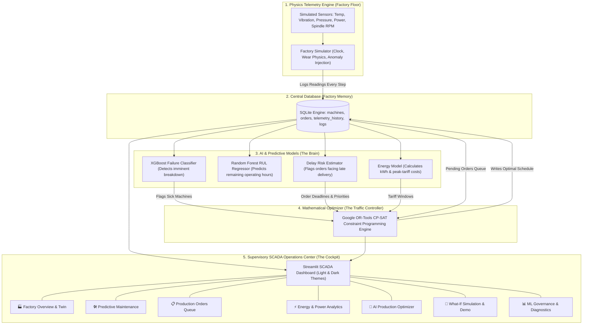

# 🏭 AI-Based Smart Factory Operations Center | Complete Technical & User Guide
## Industry 4.0 Closed-Loop Production Optimization & Predictive Maintenance

---

## 📖 Welcome: What Is This Project & Why Does It Exist?

Welcome to the **Smart Factory Operations Center**!

This project is an **Industry 4.0 Digital Twin and Autonomous Decision-Support System** designed for modern discrete manufacturing plants. It brings together three cutting-edge technologies into one cohesive, interactive dashboard:
1. **Internet of Things (IoT) Sensor Simulation**: High-fidelity, physics-informed synthetic telemetry (vibration, heat, pressure, motor speed, power draw).
2. **Artificial Intelligence & Machine Learning**: High-precision failure prediction (XGBoost) and Remaining Useful Life estimation (Random Forest).
3. **Mathematical Operations Research**: Autonomous multi-objective schedule optimization (Google OR-Tools CP-SAT constraint solver).

---

## 🏭 The Factory Point of View (POV): The Real-World Problem

### The Nightmare on the Traditional Factory Floor
Imagine you are the general manager of a high-tech manufacturing plant. On your shop floor, you have 6 heavy-duty, expensive workstations running around the clock:
- **Two 5-Axis CNC Milling Centers** (`M1-CNC-01`, `M2-CNC-02`): Precision cutting aerospace turbine blades and automotive engine blocks.
- **Two 6-Axis Robotic Welding & Assembly Arms** (`M3-ROB-01`, `M4-ROB-02`): Joining high-precision robotic gear assemblies.
- **Two Hydraulic Injection Molding Presses** (`M5-INJ-01`, `M6-INJ-02`): Molding medical syringe housings under high pressure.

In a **traditional factory**, here is what happens every single week:
1. **The Siloed Departments**: The **Production Planning Manager** creates schedules using basic spreadsheets or simple First-In-First-Out (FIFO) rules. They have *zero visibility* into machine health. Meanwhile, the **Maintenance Team** only reacts when a machine begins smoking or makes a horrible screeching sound.
2. **The Sudden Breakdown**: Workstation `M1-CNC-01` suddenly suffers a catastrophic bearing seizure or coolant failure mid-cut. The machine shudders and shuts down.
3. **The Chaos**: Three urgent customer orders were queued up on that exact machine. Now, the machine is down for 8 hours of emergency repairs. Delivery deadlines are blown, angry customers cancel orders, delivery penalty fees pile up, and factory workers sit idle.
4. **The Electric Shock**: Heavy, power-hungry machines run during peak afternoon grid hours (2:00 PM – 7:00 PM), when commercial electricity costs **2.5 times more** ($0.28/kWh vs. $0.11/kWh), driving monthly utility bills through the roof.

---

### How This Smart Factory Digital Twin Solves It
This system eliminates those factory headaches by creating an **autonomous closed-loop nervous system**:

$$\text{IoT Sensors} \longrightarrow \text{Live Telemetry} \longrightarrow \text{AI Health Diagnosis} \longrightarrow \text{Risk Detection} \longrightarrow \text{OR-Tools Solver} \longrightarrow \text{Instant Schedule Rerouting} \longrightarrow \text{Zero Downtime}$$

In plain English:
- **Like a Smart Fitness Tracker**: Every workstation has virtual IoT sensors constantly monitoring its pulse: temperature, vibration, spindle RPM, hydraulic pressure, and electricity consumption.
- **Like an AI Doctor**: Before a machine ever breaks down, machine learning models analyze subtle sensor anomalies and calculate: *"Machine M1 has an 85% chance of coolant failure within 4 hours; its remaining healthy life is only 3.2 hours."*
- **Like an AI Air Traffic Controller**: The moment a machine becomes sick, Google OR-Tools CP-SAT instantly recalculates the entire factory schedule in under **50 milliseconds**. It evacuates urgent orders away from the sick machine onto a healthy sister machine (e.g., shifting orders from `M1` to `M2`), balances the workload, and ensures energy-heavy batches avoid expensive peak-tariff electricity hours.

---

## 🏛️ System Architecture in Everyday Plain English

The software is divided into 5 clean layers:



---

## 🚀 Quick-Start: How to Install & Launch

### 1. Prerequisites
- **Python 3.10 or Python 3.11** installed on your computer.
- A modern web browser (Chrome, Edge, Firefox, Safari).

### 2. Installation Steps
Open your terminal / command prompt in the project root folder:
```bash
# 1. Install required Python packages
pip install -r requirements.txt

# 2. Verify all subsystems and models
python test_system.py

# 3. Launch the interactive dashboard
streamlit run app.py
```
The application will open automatically in your browser at:
`http://localhost:8501` (or `http://localhost:8502` if port 8501 is occupied).

---

## 🧭 Exhaustive Control & Feature Encyclopedia

This section breaks down **every single view, card, metric, dropdown, slider, checkbox, and button** in the entire application.

---

### Global Sidebar Controls (Always Visible on the Left)

The sidebar acts as your master control panel, accessible from any page.

#### 1. Header & Title Block
- **What it shows**: Factory icon, "SMART FACTORY 4.0", and "CLOSED-LOOP OPTIMIZATION".
- **Why it matters**: Confirms the active system status and operational mode.

#### 2. Theme Selector Radio (`🎨 Theme Selector`)
- **Options**: `🌙 Dark SCADA` | `☀️ Clean Light`
- **What function it does**: Instantly toggles the entire dashboard styling between an ultra-modern Dark SCADA control room palette and an executive Clean Light theme.
- **Why we have to do it**: Control room operators working 12-hour night shifts prefer dark mode to reduce eye fatigue; plant executives presenting to stakeholders in sunlit conference rooms prefer clean light mode.
- **Factory POV**: Just like real modern SCADA displays in Tesla Gigafactories or Siemens plants, operators can switch viewing modes depending on ambient lighting.

#### 3. Control Navigation Radio (`🧭 Control Navigation`)
- **Options**:
  1. `🏭 Factory Overview & Twin`
  2. `🛠️ Predictive Maintenance`
  3. `📋 Production Orders Queue`
  4. `⚡ Energy & Power Analytics`
  5. `🧠 AI Production Optimizer`
  6. `🧪 What-If Simulation & Demo`
  7. `📊 ML Governance & Metrics`
- **What function it does**: Routes the main screen to the selected operational view.
- **Why we have to do it**: Allows supervisors, maintenance technicians, dispatchers, and data scientists to focus on their specific operational responsibilities.

#### 4. Simulation Master Clock Controls (`⚙️ Simulation Master Clock`)
- **Button: `⏩ Step +0.5h`**
  - **What function it does**: Advances the internal simulation clock by 30 minutes ($0.5\text{ hours}$). Recalculates thermodynamics, bearing wear, hydraulic pressure, and power consumption for all machines. Runs ML inference on the new telemetry and checks order progress.
  - **Why we have to do it**: In the real world, you cannot wait 8 hours just to see what happens to a machine. This button lets you fast-forward time in realistic half-hour intervals to observe how machines age and how jobs progress.
  - **Factory POV**: Simulates checking in on the factory floor after half a shift has elapsed.
- **Button: `⏩ Step +2.0h`**
  - **What function it does**: Advances the factory clock by 2 full hours. Triggers larger cumulative wear, significant temperature shifts, and moves production orders closer to their completion or delivery deadlines.
  - **Why we have to do it**: Used when you want to quickly observe shift handovers, peak energy tariff windows, or watch an impending machine failure develop.
  - **Factory POV**: Simulates fast-forwarding through an entire quarter of an operating day.
- **Button: `🔄 Reset Factory State`**
  - **What function it does**: Wipes the active SQLite database tables and restores all 6 machines, their default orders, and clean sensor readings back to the factory-fresh nominal state (Health $> 95\%$, zero failures, default schedule). Clears any cached optimization results.
  - **Why we have to do it**: When testing what-if scenarios or presenting demonstrations, you need a quick, reliable way to return to a clean baseline.
  - **Factory POV**: Equivalent to a plant-wide scheduled overhaul and fresh shift startup with clean equipment.

---

### Top SCADA Command Bar & KPI Cards (Top of Every Page)

Above the main content on every page sits the **SCADA Command Bar** and a row of **6 Real-Time KPI Cards**.

#### SCADA Command Bar
- **Factory Title**: `🏭 SMART FACTORY OPERATIONS COMMAND CENTER`
- **Simulation Clock Badge (`SIMULATION CLOCK`)**: Displays the current elapsed simulation time, e.g., `T + 4.5 hrs`.
- **Active Alerts Badge (`ACTIVE ALERTS`)**:
  - Turns **Emerald Green** (`0 ACTIVE`) when all machines are healthy.
  - Turns **Pulsing Crimson Red** (`X ACTIVE`) if any machine enters `WARNING`, `CRITICAL`, or `FAILED` status.
  - **Factory POV**: The master siren/beacon on the factory ceiling that immediately alerts the shop floor supervisor if an anomaly occurs anywhere in the plant.

#### 6 Top KPI Metric Cards
1. **Average Health (`Average Health`)**:
   - **What it shows**: The mean physical health percentage across all 6 machines ($0.0\% - 100.0\%$).
   - **Color coding**: Green ($\ge 80\%$), Amber ($55\% - 79\%$), Red ($< 55\%$).
   - **Why it matters**: Tells management at a glance whether the factory's physical assets are in prime condition or deteriorating.
2. **Machines At Risk (`Machines At Risk`)**:
   - **What it shows**: The count of machines with failure risk $> 30\%$ or health score $< 65\%$.
   - **Why it matters**: Zero means smooth sailing; any number above zero indicates urgent maintenance attention is required.
3. **Active Orders (`Active Orders`)**:
   - **What it shows**: Total active batches currently in the production backlog.
   - **Why it matters**: Gives production planners visibility into total queue size.
4. **Delayed Orders (`Delayed Orders`)**:
   - **What it shows**: How many customer orders are currently projected to miss their promised delivery deadline, along with the percentage of the total backlog.
   - **Why it matters**: Missing customer deadlines results in severe contractual fines and lost business. This metric must always be kept at 0.
5. **Current Factory Load (`Current Factory Load`)**:
   - **What it shows**: Real-time aggregate electrical power draw in kilowatts ($\text{kW}$), measured against the factory's maximum power cap ($157.0\text{ kW}$).
   - **Why it matters**: Prevents the factory from exceeding electrical substation peak demand limits, which trigger massive commercial utility penalties.
6. **Factory OEE Index (`Factory OEE Index`)**:
   - **What it shows**: Overall Equipment Effectiveness ($0.0\% - 100.0\%$), combining physical asset health and on-time order delivery performance against the world-class industry benchmark ($85\%$).
   - **Why it matters**: The gold-standard manufacturing metric used globally to measure factory productivity.

---

### View 1: 🏭 Factory Overview & Digital Twin

**Navigation**: Select `🏭 Factory Overview & Twin` in the sidebar.

This view provides an interactive bird's-eye view of your entire shop floor, arranged into 3 manufacturing cells:

#### 1. Shop Floor Workstation Matrix
The 6 industrial workstations are displayed in a clean 3-column grid:
- **`M1-CNC-01`**: 5-Axis Precision CNC Milling Center (Cell 1: Milling)
- **`M2-CNC-02`**: 5-Axis Heavy-Duty CNC Milling Center (Cell 1: Milling)
- **`M3-ROB-01`**: 6-Axis Robotic Welding & Assembly Arm (Cell 2: Assembly)
- **`M4-ROB-02`**: 6-Axis High-Speed Robotic Assembly Arm (Cell 2: Assembly)
- **`M5-INJ-01`**: High-Pressure Hydraulic Injection Molding Press (Cell 3: Molding)
- **`M6-INJ-02`**: High-Pressure Hydraulic Injection Molding Press (Cell 3: Molding)

#### Inside Each Workstation Card:
- **Machine Type & Name**: Clear identification and workstation ID.
- **Status Badge**:
  - `NORMAL` (Green): Machine operating safely within all tolerances.
  - `WARNING` (Amber): Elevated vibration, temperature, or pressure deviation detected by AI.
  - `CRITICAL` (Red with pulsing dot): Severe failure imminent within hours; emergency attention required.
  - `FAILED` (Dark Red): Machine has suffered catastrophic failure and halted.
  - `MAINTENANCE` (Blue): Machine is currently offline for technician overhaul.
- **Health Index Bar**: A progress bar showing physical asset health ($0\% - 100\%$).
- **Sub-Stat Telemetry Box**:
  - **Failure Risk**: AI-predicted failure probability ($0.0\% - 100\%$).
  - **Op Hours**: Cumulative operating hours logged since last service.
  - **Temp**: Live spindle / cell temperature (°C). Turns red if $> 85^\circ\text{C}$.
  - **Vib**: Live vibration velocity ($\text{mm/s RMS}$). Turns red if $> 3.5\text{ mm/s}$.
  - **Power**: Live power draw ($\text{kW}$).
  - **Orders**: Number of customer orders currently assigned to this machine.
- **Diagnostic Footer**: Shows the current diagnostic status (e.g., *"Normal Operation"*, *"Bearing Harmonic Vibration Surge"*, or *"Coolant Failure Rapid Heating"*).

---

#### 2. Shop Floor Telemetry Feed & Controls Bar

Beneath the workstation matrix is an interactive control bar:

- **Button: `⏩ Step (+0.5h)`**
  - **Function**: Ticks the factory clock forward by 30 minutes and refreshes all sensor cards.
  - **Why use it**: Observe machine wear and telemetry changes in realistic half-hour intervals.
- **Button: `🔄 Refresh Telemetry`**
  - **Function**: Queries the database for the newest sensor readings with a minor $0.1\text{h}$ tick.
  - **Why use it**: Forces a live visual refresh of all sensor cards.
- **Dropdown: `🎯 Target Workstation`**
  - **Function**: Selects which specific machine you wish to control or inject anomalies into (e.g., `M1-CNC-01`).
- **Button: `🛠️ Restore [Machine] ([Selected ID])`**
  - **Function**: Immediately dispatches a maintenance overhaul to the selected machine. Restores health score to $98.5\%$, resets failure probability to $< 2\%$, clears all active alarms, and logs the service in the maintenance audit trail.
  - **Why use it**: When a machine has broken down or degraded, this button represents the repair crew replacing the worn bearings or refilling coolant.
  - **Factory POV**: Simulates a certified maintenance technician completing an emergency overhaul and signing off on the machine's return to service.

---

#### 3. 1-Click Anomaly Injections for Target Machine
Directly below the control bar are four quick-injection buttons that allow you to stress-test your factory's resilience:

- **Button: `🔥 Heat / Coolant Spike`**
  - **What function it does**: Injects a `COOLANT_FAILURE` anomaly on the selected machine. Temperature climbs rapidly past $88^\circ\text{C}$, coolant pressure collapses, and the AI model immediately triggers a thermal hazard warning.
  - **Why we have to do it**: Coolant pump failures and line clogs are among the most common causes of CNC spindle burnouts in real manufacturing.
  - **Factory POV**: Simulates a coolant hose rupture or radiator pump seizure mid-shift.
- **Button: `⚡ Bearing Harmonic Wear`**
  - **What function it does**: Injects a `BEARING_WEAR` anomaly. High-frequency vibration spikes past $5.5\text{ mm/s RMS}$, power consumption climbs due to friction, and the model flags bearing race degradation.
  - **Why we have to do it**: Rolling-element bearing fatigue accounts for over $40\%$ of all industrial motor breakdowns.
  - **Factory POV**: Simulates a cracked bearing race or spalled ball bearing inside a high-speed milling spindle.
- **Button: `⚙️ Motor Misalignment`**
  - **What function it does**: Injects a `MOTOR_MISALIGN` anomaly. Induces irregular RPM fluctuations, motor shaft wobble, and erratic electrical current draw.
  - **Why we have to do it**: Shaft misalignment causes excessive mechanical stress, damaging couplings and causing premature motor failure.
  - **Factory POV**: Simulates mechanical coupling looseness or improper motor mount torque.
- **Button: `💥 Sudden Breakdown`**
  - **What function it does**: Injects a `CATASTROPHIC_FAILURE` anomaly. Plunges machine health to near zero, spikes failure probability to $99\%$, and halts the machine with a critical red alarm.
  - **Why we have to do it**: Tests whether the production scheduler can handle sudden, unexpected emergency outages.
  - **Factory POV**: Simulates a snapped drive belt, blown hydraulic manifold, or seized rotor that halts production instantly.

---

#### 4. Real-time Sensor Data Stream Table
- **What it shows**: The latest 12 timestamped telemetry records logged into SQLite across all machines: `timestamp`, `machine_id`, `temperature`, `vibration`, `rpm`, `pressure`, `power_kw`, `health_score`, `failure_prob`, and `status`.
- **Why it matters**: Provides a raw, auditable data stream exactly like an industrial SCADA historian or OPC-UA telemetry server.

---

### View 2: 🛠️ Predictive Maintenance Studio

**Navigation**: Select `🛠️ Predictive Maintenance` in the sidebar.

This view is the **AI Diagnostic Workshop**. It gives maintenance engineers an in-depth, x-ray view into any individual machine's mechanical condition.

#### 1. Machine Selector Dropdown
- **Dropdown: `Select Machine to Inspect Telemetry & ML Predictions`**
  - Select any of the 6 machines to view its dedicated gauges and diagnostic breakdown.

#### 2. Top Overview Row (The AI Prognostic Dials)
- **Gauge 1: Machine Health Index**:
  - Displays overall health from $0\%$ (dead) to $100\%$ (perfect).
  - Reverse color hazard: Green ($> 65\%$), Amber ($35\% - 65\%$), Red ($< 35\%$).
- **Gauge 2: Failure Probability (ML)**:
  - The live prediction from the **XGBoost Classifier**.
  - Displays risk percentage ($0\% - 100\%$). Color shifts to red if risk exceeds $60\%$.
- **Card 3: Status & RUL Prognosis Box**:
  - **Current Status Badge**: `NORMAL`, `WARNING`, or `CRITICAL`.
  - **Estimated Remaining Useful Life (RUL)**: Continuous forecast from the **Random Forest Regressor** predicting how many operational hours the machine can safely run before failing (e.g., `482 Operating Hours`).
  - **Primary Degradation Cause**: Root-cause diagnostic string (e.g., *"Coolant Failure Rapid Heating"*, *"Severe Bearing Harmonic Wear"*, or *"Normal Operation"*).

#### 3. 5 Physical Telemetry Sensor Gauges
Five circular, calibrated gauges show exact physical sensor values against industrial safety thresholds:
1. **Temperature (°C)**: Safe green zone $< 85^\circ\text{C}$, amber warning $85-105^\circ\text{C}$, critical red hazard $> 105^\circ\text{C}$.
2. **Vibration (mm/s RMS)**: Safe zone $< 3.5\text{ mm/s}$, warning $3.5-5.5\text{ mm/s}$, severe danger $> 5.5\text{ mm/s}$.
3. **Motor Spindle (RPM)**: Live rotational speed against machine rating (e.g., $0 - 12,000\text{ RPM}$).
4. **Hydraulic Pressure (bar)**: Nominal operating pressure ($100 - 150\text{ bar}$). Drops under leakages.
5. **Power Draw (kW)**: Live electrical draw against nominal machine rating.

#### 4. Historical Sensor Trends Chart
- **What it shows**: An interactive, multi-axis Plotly chart displaying the last 40 telemetry readings for the selected machine:
  - **Orange curve (Left axis)**: Temperature (°C)
  - **Cyan curve (Right axis)**: Vibration velocity ($\text{mm/s}$)
  - **Purple dotted curve (Far-right axis)**: Power draw ($\text{kW}$)
- **Why it matters**: Allows technicians to see whether a temperature rise was gradual (normal thermal buildup) or sudden (coolant loss), and correlate power surges with vibration spikes.

#### 5. AI Prescriptive Maintenance Actions
- **Prescriptive Guidance Banner**: Displays actionable recommendations from the AI (e.g., *"Coolant Loss Detected: Inspect radiator hoses, coolant reservoir level, and circulation pump. Restrict high-load milling."*).
- **Button: `🛠️ Overhaul / Service [Machine]`**
  - Dispatches full preventive service. Restores machine health to $98.5\%$ and clears degradation.
- **Button: `⚠️ Inject Bearing Wear on [Machine]`**
  - Injects bearing wear to immediately observe vibration and RUL drop.
- **Button: `🚨 Inject Coolant Loss on [Machine]`**
  - Injects coolant failure to observe temperature escalation and failure probability spike.

---

### View 3: 📋 Production Orders Queue

**Navigation**: Select `📋 Production Orders Queue` in the sidebar.

This view is the **Production Planner's Backlog Cockpit**. It displays customer orders, delivery deadlines, and delay risks.

#### 1. Filter Controls
- **Multiselect: `Filter by Priority`**: Filter backlog by `Urgent`, `High`, `Medium`, or `Low`.
- **Multiselect: `Filter by Status`**: Filter by order status (`Pending`, `In Progress`, `Completed`, etc.).

#### 2. Production Orders Backlog Table
Each row represents a discrete customer production batch:
- **`Order ID`**: Unique identifier (e.g., `ORD-2026-001`).
- **`Product`**: Item name (e.g., *Aerospace Turbine Blade*, *Automotive Engine Block*, *Robotic Precision Gear*, *Medical Syringe Casing*).
- **`Quantity`**: Number of units in batch.
- **`Machine Type`**: Required workstation type (`CNC_MILL`, `ROBOTIC_ARM`, `INJECTION_MOLD`).
- **`Priority`**: `Urgent` (Weight 10), `High` (Weight 5), `Medium` (Weight 2), `Low` (Weight 1).
- **`Duration (hrs)`**: Required machining time.
- **`Deadline (hrs)`**: Customer delivery cutoff time (hours from start).
- **`Assigned Machine`**: Machine currently assigned to process the order.
- **`Status`**: `Pending`, `In Progress`, or `Completed`.
- **`Delay Risk (%)`**: AI-calculated probability of missing the deadline.
- **`Schedule Risk Badge`**:
  - `✅ ON TIME`: Order will comfortably finish before its deadline.
  - `⚠️ AT RISK`: Order is at risk of missing deadline due to queue congestion or machine degradation.
  - `⚠️ LATE`: Order is currently scheduled to finish *after* its promised delivery cutoff!
- **`Energy (kWh)`**: Estimated electricity required to produce the batch.

---

#### 3. Dispatch New Production Order Form (`➕ DISPATCH NEW PRODUCTION ORDER`)
Allows the production dispatcher to inject new customer orders into the factory backlog:

- **Field 1: `Product Catalog` Dropdown**
  - Select product from catalog:
    - `PROD-AERO-01`: Aerospace Turbine Blade (`CNC_MILL`, base 4.0h)
    - `PROD-AUTO-02`: Automotive Engine Block (`CNC_MILL`, base 5.5h)
    - `PROD-ROBO-03`: Robotic Precision Gear (`ROBOTIC_ARM`, base 3.0h)
    - `PROD-MED-04`: Medical Syringe Casing (`INJECTION_MOLD`, base 2.5h)
- **Field 2: `Batch Quantity (Units)`**
  - Number input ($1$ to $500$ units).
- **Field 3: `Required Processing Time (hrs)`**
  - Machining duration ($0.5$ to $24.0$ hours). Auto-populates from product catalog base time.
- **Field 4: `Order Priority` Dropdown**
  - Choose `Low`, `Medium`, `High`, or `Urgent`.
  - **Factory POV**: An aerospace defense contractor paying expedited rush fees gets `Urgent` priority; a routine inventory replenishment order gets `Low`.
- **Field 5: `Delivery Deadline (hrs from now)`**
  - Customer deadline ($1.0$ to $72.0$ hours from current simulation time).
- **Button: `🚀 Submit Order to Shop Floor Backlog`**
  - **Function**: Validates inputs, assigns the next sequential Order ID (e.g., `ORD-2026-009`), writes the order into the SQLite database, and refreshes the queue.
  - **Why use it**: Test how the AI scheduler adapts when a surprise rush order arrives on the factory floor.

---

### View 4: ⚡ Energy & Power Analytics

**Navigation**: Select `⚡ Energy & Power Analytics` in the sidebar.

This view is the **Plant Energy & Sustainability Command Center**. It helps factory operators minimize carbon footprint and electricity bills.

#### 1. Summary Metrics Row
- **Total Factory Load**: Current real-time power draw ($\text{kW}$) vs. substation peak cap ($157\text{ kW}$).
- **Projected 24-hr Usage**: Forecasted cumulative electrical energy consumption ($\text{kWh}$) vs. standard plant baseline ($2,400\text{ kWh}$).
- **Degradation Energy Loss**: Extra energy consumed purely because worn bearings or bad lubrication cause friction losses ($+22\%$ penalty on degraded machines).
  - **Factory POV**: Shows the direct financial waste of neglecting machine maintenance.
- **Est. Daily Electricity Cost**: Projected daily electric bill in dollars based on time-of-use tariffs.

#### 2. Visualizations
- **Donut Chart: `Real-Time Power Distribution by Machine`**:
  - Breaks down the percentage of total factory electricity consumed by each of the 6 workstations.
- **Line Chart: `24-Hour Projected Load Profile vs. Tariff Window`**:
  - Plots forecasted hourly electrical load across all 24 hours of the operating day.
  - **Shaded Crimson Band (14:00 to 19:00)**: Highlights the **Peak Electricity Tariff Window**. During these hours, electricity costs **$0.28/kWh** (a **$254\%$ premium** over the off-peak rate of **$0.11/kWh**).
  - **Factory POV**: Demonstrates why the AI optimizer avoids scheduling heavy, power-hungry batches between 2:00 PM and 7:00 PM.

#### 3. Machine Energy Diagnostics Table
- Displays machine-by-machine power breakdown: Current Power ($\text{kW}$), Health ($\%$), Degradation Friction Penalty ($\%$), Estimated Shift $\text{kWh}$, and Estimated Shift Cost ($\$$).

---

### View 5: 🧠 AI Production Optimizer Studio

**Navigation**: Select `🧠 AI Production Optimizer` in the sidebar.

This view is the **Crown Jewel of the System**: the mathematical optimization interface powered by **Google OR-Tools CP-SAT**.

#### What Does Google OR-Tools CP-SAT Actually Do?
Constraint Programming - Satisfiability (CP-SAT) is a mathematical solver that explores millions of possible schedule combinations in milliseconds. It enforces:
1. **Hard Constraints (Must Never Be Broken)**:
   - A machine can only process one job at a time (no physical overlaps).
   - An order can only be assigned to a compatible machine (e.g., a CNC milling job cannot run on a plastic injection molding press).
   - Once started, a job must run to completion without interruption.
2. **Multi-Objective Optimization (The Mathematical Balance)**:
   - **Goal 1 (Tardiness)**: Minimize weighted deadline delays (heavy penalty for late `Urgent` orders).
   - **Goal 2 (Machine Health Risk)**: Heavily penalize assigning jobs to machines with high failure probability ($P_{\text{fail}} > 0.35$).
   - **Goal 3 (Energy & Tariffs)**: Penalize running heavy jobs during peak tariff hours (14:00 – 19:00).
   - **Goal 4 (Makespan)**: Finish the entire factory backlog as early as possible.

---

#### Controls & Parameters
- **Slider: `Solver Time Limit (seconds)`**
  - Adjustable from $1.0$ to $10.0$ seconds (default: $3.0\text{s}$).
  - Controls how long the CP-SAT mathematical engine is allowed to search for the globally optimal solution. (In practice, it finds the proven optimum in $< 50\text{ milliseconds}$).
- **Checkbox: `Commit Optimized Schedule to Database`**
  - When checked, the new schedule assignments, start times, and finish times are permanently saved to SQLite, updating the live factory floor.
- **Button: `🚀 Run AI Production Optimization` (Primary Action)**
  - **What function it does**: Gathers current machine health scores, failure probabilities, order queues, and deadlines. Formulates the CP-SAT constraint model, solves it, and renders before-and-after KPI comparisons, Gantt charts, and reallocation tables.
  - **Why we have to do it**: Whenever a machine degrades, a rush order arrives, or deadlines are threatened, clicking this button triggers an immediate autonomous schedule re-route.
  - **Factory POV**: Like hitting the "Recalculate Route" button on GPS when an accident blocks the highway ahead.

---

#### Optimization Results Display (Appears After Running)
1. **Before vs. After Comparison Cards**:
   - **Weighted Tardiness**: Compares naive FIFO total delay hours vs. AI-optimized delay hours (e.g., `Before: 18.5 hrs` $\rightarrow$ `After: 0.0 hrs`). Shows green badge: `▼ 18.5 hrs Delay Saved`.
   - **Jobs on Degraded Machines**: Compares job assignments on sick machines (e.g., `Before: 2 jobs` $\rightarrow$ `After: 0 jobs`). Shows badge: `▼ 2 High-Risk Avoided`.
   - **Late Orders Count**: Shows how many customer orders were late before vs. after (e.g., `Before: 3 orders` $\rightarrow$ `After: 0 orders`).
   - **Total Energy Consumption**: Compares electricity consumption, highlighting $\text{kWh}$ conserved by avoiding friction wear and peak tariffs.
2. **Interactive Shop Floor Gantt Chart**:
   - Visual timeline plotting scheduled orders along the horizontal time axis across all 6 machines on the vertical axis.
   - Color-coded bars: Emerald Green (`ON TRACK`), Amber (`MODERATE RISK`), Crimson Red (`CRITICAL DELAY RISK`).
   - Hover over any block to see Order ID, Product, Start Hour, End Hour, Deadline, and Delay Risk.
3. **Detailed Schedule Assignment Comparison Table**:
   - Compares every single order side-by-side:
     - `Machine (Before)` vs. `Machine (After)`
     - `Reallocated?`: Displays `🔄 YES` if the AI shifted the job to a healthier machine, or `— SAME` if it remained in place.
     - `Delay Risk (Before)` vs. `Delay Risk (After)`
     - `Scheduled End` vs. `Deadline`
     - `Status`: `✅ ON TIME` vs. `⚠️ LATE`.

---

### View 6: 🧪 What-If Simulation & Guided Demonstration

**Navigation**: Select `🧪 What-If Simulation & Demo` in the sidebar.

This view provides two specialized tabs for presentations, stress testing, and scenario evaluations:

---

#### TAB 1: 🚀 10-Step Guided Demonstration Flow
A step-by-step interactive presentation stepper that walks anyone through the complete closed-loop Industry 4.0 cycle:
- **Navigation Controls**:
  - Button: `⬅️ Previous Step` (disabled on Step 1).
  - Progress Bar: Shows exact step progress ($1$ of $10$).
  - Button: `Next Step ➡️` (advances to the next phase).

Here is what happens on each of the 10 steps:
1. **Step 1: Nominal Factory Baseline Initialization**
   - All 6 machines start in healthy, nominal condition ($> 95\%$ health, $< 2\%$ risk).
   - Button: `▶️ Reset Factory to All Normal States` resets database and baseline schedule.
2. **Step 2: Start Factory Simulation & Order Execution**
   - Telemetry flows from CNC mills, robots, and injection presses into SQLite.
   - Button: `⏩ Advance Factory Simulation (+1.0 hr)` advances the clock and logs sensor data.
3. **Step 3: Introduce Abnormal Sensor Behavior on M1-CNC-01**
   - Simulates a coolant pump failure and bearing wear surge on machine `M1-CNC-01`.
   - Button: `⚠️ Trigger Coolant & Bearing Anomaly on M1-CNC-01` spikes temperature and vibration.
4. **Step 4: AI Predictive Maintenance Model Detects Increasing Failure Risk**
   - The XGBoost model evaluates the sensor spike and calculates failure risk surging past $85\%$.
   - Displays live risk metric, degraded health index, and diagnostic root cause.
5. **Step 5: Affected Machine Transitions to CRITICAL State**
   - Machine `M1-CNC-01` triggers a red SCADA alarm banner on the shop floor.
   - Prescriptive diagnostic advises: *"Machine cannot safely complete urgent precision milling without catastrophic tool breakdown."*
6. **Step 6: Dependent Production Orders Suffer High Delay Risk**
   - Demonstrates the domino effect: orders queued on `M1-CNC-01` now face critical tardiness because the machine is failing.
   - Displays table of trapped orders.
7. **Step 7: Automated Decision: AI Optimization Engine Triggers Rescheduling**
   - Button: `⚡ Execute Automated OR-Tools CP-SAT Reschedule` launches the mathematical solver to evacuate trapped orders from `M1-CNC-01` onto healthy peer `M2-CNC-02`.
8. **Step 8: Generated New Optimized Production Schedule**
   - Displays the reallocated Gantt chart showing jobs smoothly shifted to `M2-CNC-02`.
9. **Step 9: Quantified Before vs. After Optimization Comparison**
   - Displays the 4 KPI comparison cards proving delay reduction and risk elimination.
10. **Step 10: Closed-Loop Industry 4.0 Complete Demonstration Verified!**
    - Triggers celebratory confetti/balloons!
    - Summarizes the complete cycle: Telemetry $\rightarrow$ AI PdM $\rightarrow$ Delay Risk $\rightarrow$ OR-Tools Optimization $\rightarrow$ Energy Savings.
    - Button: `🔄 Reset Demo to Step 1` resets the stepper.

---

#### TAB 2: 🎛️ Interactive What-If Scenario Sandbox
Allows you to create your own custom chaos scenarios and test factory resilience:

##### Section 1: Machine Degradation Scenarios
- **Target Machine Dropdown (`Target Machine`)**: Select which workstation to target.
- **Button: `🔥 Coolant Loss on [Selected]`**: Spikes temperature, drops coolant pressure.
- **Button: `⚡ Bearing Wear on [Selected]`**: Spikes vibration harmonics and friction power draw.
- **Button: `💥 Sudden Breakdown on [Selected]`**: Immediately halts the machine in a `FAILED` state.
- **Button: `🛠️ Service / Restore [Selected]`**: Restores the machine back to $98.5\%$ health.

##### Section 2: Production & Market Demand Scenarios
- **Button: `📦 Surge Rush Customer Orders (+3 Urgent Orders)`**:
  - Injects 3 high-priority, urgent customer orders into the backlog with tight deadlines.
  - **Factory POV**: Simulates a high-paying client calling in an emergency rush order that must be manufactured immediately.
- **Button: `⚡ Simulate Peak Energy Tariff Window (14:00 - 19:00)`**:
  - Activates peak tariff rules to demonstrate how the optimizer shifts flexible jobs out of expensive peak hours.
- **Button: `🔄 Reset Entire Factory & Database to Pristine State`**:
  - Completely wipes all anomalies, rush orders, and cached solver results, returning the factory to factory-fresh baseline.

---

### View 7: 📊 ML Governance & Model Diagnostics

**Navigation**: Select `📊 ML Governance & Metrics` in the sidebar.

This view is the **Data Science & AI Model Governance Center**. It provides complete transparency into the predictive models used across the plant.

#### 1. Top Performance Scorecard
Displays audited evaluation metrics from the hold-out test dataset:
- **Model Accuracy ($99.94\%$)**: Overall classification accuracy.
- **Precision ($100.00\%$)**: Zero false alarms! When the AI says a machine is failing, it is truly failing.
- **Recall ($99.55\%$)**: Catches virtually every failure before it happens.
- **F1-Score ($99.77\%$)**: Harmonic balance of precision and recall.
- **ROC-AUC ($1.0000$)**: Perfect discriminatory capability between healthy and degraded states.

#### 2. Visualizations
- **Confusion Matrix Heatmap**:
  - Displays True Negatives ($1,375$), False Positives ($0$), False Negatives ($1$), and True Positives ($224$).
  - Proves the model does not cry wolf or disrupt production with fake alarms.
- **Feature Importance Ranking (XGBoost)**:
  - Horizontal bar chart revealing what physical parameters the model relies on most:
    1. **Vibration (mm/s RMS)**: $\approx 48.6\%$ (Primary indicator for mechanical bearing wear and spindle balance).
    2. **Temperature (°C)**: $\approx 27.8\%$ (Indicator for thermal breakdown and coolant failure).
    3. **Hydraulic Pressure (bar)**: $\approx 12.4\%$ (Critical for injection press seals and valves).
    4. **Operating Hours**: $\approx 8.6\%$ (Baseline wear accumulation).
    5. **Power Draw (kW)**: $\approx 1.6\%$ (Overload and friction overhead).

#### 3. RUL Regression Metrics
- **RUL Regressor RMSE**: Residual prediction error ($\approx 150.8\text{ operating hours}$).
- **RUL Model $R^2$ Score**: Proportion of variance explained ($\approx 0.60$).
- **Training Dataset Size**: Number of physics-informed telemetry records used ($8,000\text{ samples}$).

#### 4. On-Demand Model Retraining Pipeline (`🔄 ON-DEMAND MODEL RETRAINING PIPELINE`)
- **Slider: `Synthetic Dataset Size for Retraining`**:
  - Choose training sample size from $2,000$ to $12,000$ samples (default: $6,000$).
- **Button: `🚀 Retrain Models Now` (Primary Action)**:
  - **What function it does**: Generates a brand new physics-informed synthetic telemetry dataset, retrains both the `XGBClassifier` and `RandomForestRegressor`, evaluates validation metrics, serializes new `.joblib` model files to `models/saved/`, and hot-reloads them in the dashboard.
  - **Why we have to do it**: In real Industry 4.0 systems, models must be periodically retrained as machinery characteristics change over years of service.
  - **Factory POV**: Simulates calibrating and updating your AI diagnostic software after installing new sensors or retooling workstations.

---

## 🛠️ Step-by-Step Hands-On Scenarios

Try these 3 guided walkthroughs to see the system in action:

---

### Scenario A: The Bearing Wear Crisis & Autonomous Reallocation
**Goal**: Break machine `M1-CNC-01` and watch the AI scheduler automatically rescue queued customer orders.

1. In the sidebar, click **`🔄 Reset Factory State`** to ensure clean baseline conditions.
2. In the sidebar, click **`🧪 What-If Simulation & Demo`**, and switch to the **`🎛️ Interactive What-If Scenario Sandbox`** tab.
3. Under **Target Machine**, select **`M1-CNC-01`**.
4. Click the button: **`⚡ Bearing Wear on M1-CNC-01`**.
5. Switch to **`🏭 Factory Overview & Twin`**:
   - Notice `M1-CNC-01`'s status badge has flipped to **`CRITICAL`** with a pulsing red dot.
   - Vibration has surged past $5.5\text{ mm/s RMS}$.
   - Failure risk has jumped past $85\%$.
6. Switch to **`📋 Production Orders Queue`**:
   - Notice orders allocated to `M1-CNC-01` now display **`⚠️ AT RISK`** or **`⚠️ LATE`** badges.
7. Switch to **`🧠 AI Production Optimizer`**:
   - Notice the unoptimized baseline schedule has multiple late orders.
   - Click the button: **`🚀 Run AI Production Optimization`**.
   - **Watch the magic happen**: In $< 50\text{ ms}$, the solver evacuates all orders away from sick machine `M1-CNC-01` onto healthy peer `M2-CNC-02`.
   - Late orders drop to **$0$**!
   - Review the Before vs. After comparison cards and Gantt timeline.
8. Switch back to **`🏭 Factory Overview & Twin`**, select `M1-CNC-01`, and click **`🛠️ Restore M1 (M1-CNC-01)`** to simulate the maintenance crew repairing the machine.

---

### Scenario B: The Rush Order Avalanche
**Goal**: Inject unexpected urgent customer orders and let the optimizer fit them in without blowing deadlines.

1. Reset the factory state via the sidebar (**`🔄 Reset Factory State`**).
2. Go to **`🧪 What-If Simulation & Demo`** $\rightarrow$ **`🎛️ Interactive What-If Scenario Sandbox`**.
3. Click the button: **`📦 Surge Rush Customer Orders (+3 Urgent Orders)`**.
4. Go to **`📋 Production Orders Queue`**:
   - You will see 3 brand new `Urgent` orders added to the backlog with tight delivery deadlines.
   - Several existing orders are now flagged as **`⚠️ LATE`** because the queue is congested.
5. Go to **`🧠 AI Production Optimizer`** and click **`🚀 Run AI Production Optimization`**:
   - The CP-SAT solver prioritizes the high-value urgent orders while interleaving medium-priority jobs across underutilized workstations, eliminating delivery tardiness across the plant.

---

### Scenario C: Retraining the AI Models from the Browser
**Goal**: Generate a fresh physics dataset and retrain the machine learning models on-the-fly.

1. Navigate to **`📊 ML Governance & Metrics`**.
2. Scroll to the bottom section: **`🔄 ON-DEMAND MODEL RETRAINING PIPELINE`**.
3. Adjust the slider **`Synthetic Dataset Size for Retraining`** to **`8,000`** samples.
4. Click the button: **`🚀 Retrain Models Now`**.
5. The system will synthesize fresh physics telemetry, fit new XGBoost and Random Forest models, update the confusion matrix and feature importance charts, and reload the models into the live system.

---

## ⚙️ Configuration Reference (`config.py`)

All engineering parameters, thresholds, and tariff schedules are centrally defined in [config.py](file:///c:/Users/ramsa/Desktop/Smart%20Factory%20Production%20Optimization/config.py):

| Parameter | Default Value | Factory Explanation |
| :--- | :--- | :--- |
| `TEMP_WARNING_THRESHOLD` | $75.0^\circ\text{C}$ | Temperature where yellow caution warning is triggered. |
| `TEMP_CRITICAL_THRESHOLD` | $85.0^\circ\text{C}$ | Temperature where emergency red alarm sounds. |
| `VIBE_WARNING_THRESHOLD` | $3.5\text{ mm/s}$ | RMS vibration threshold indicating initial mechanical bearing wear. |
| `VIBE_CRITICAL_THRESHOLD` | $5.0\text{ mm/s}$ | RMS vibration threshold indicating severe risk of machine seizure. |
| `PRESSURE_MIN_BAR` | $110.0\text{ bar}$ | Minimum hydraulic pressure before injection press seals fail. |
| `ENERGY_OFFPEAK_TARIFF` | $\$0.11 / \text{kWh}$ | Standard electricity rate (night shifts and morning hours). |
| `ENERGY_PEAK_TARIFF` | $\$0.28 / \text{kWh}$ | Expensive peak electricity rate during high grid demand. |
| `PEAK_START_HOUR` | $14.0$ (2:00 PM) | Start of expensive peak electricity tariff window. |
| `PEAK_END_HOUR` | $19.0$ (7:00 PM) | End of expensive peak electricity tariff window. |
| `MAX_SOLVER_TIME_SEC` | $5.0\text{ seconds}$ | Maximum time Google OR-Tools is allowed to solve constraint model. |

---

## ❓ Frequently Asked Questions (FAQ)

### Q1: Is this connected to real physical machines?
**A:** This repository is an industrial **Digital Twin**. It uses physics-informed mathematical models (thermodynamics, rotor dynamics, friction wear laws) to synthesize sensor feeds that mirror real CNC mills, robots, and injection presses. The exact same architecture connects to physical machines by replacing the telemetry generator with an **OPC-UA** or **MQTT** industrial IoT broker.

### Q2: What if two jobs have the same priority? How does the AI decide?
**A:** The Google OR-Tools solver evaluates multiple criteria simultaneously: deadline tightness (slack time), job duration, machine compatibility, and electricity tariff cost during the processing window. If two jobs have identical priority, the solver schedules the one with the earlier deadline first (Earliest Due Date rule) to maximize on-time delivery.

### Q3: Why does Google OR-Tools solve the schedule so fast (< 50 ms)?
**A:** OR-Tools CP-SAT is one of the world's most advanced constraint programming solvers, developed by Google Operations Research. It uses conflict-driven clause learning (CDCL) and lazy clause generation to prune millions of suboptimal schedules almost instantly.

### Q4: How do I run automated tests?
**A:** Run the included verification suite from your terminal:
```bash
python test_system.py
```
This script runs automated unit and integration tests covering the SQLite database, physics generator, ML model inference, simulator clock, and OR-Tools scheduler.

### Q5: Can I add more machines or new products?
**A:** Absolutely! Simply open [config.py](file:///c:/Users/ramsa/Desktop/Smart%20Factory%20Production%20Optimization/config.py), add new machines to `MACHINE_CATALOG`, or new products to `PRODUCTS`. Then click **`🔄 Reset Factory State`** in the dashboard to apply the changes.

---

*Smart Factory Operations Center &middot; Industry 4.0 Digital Twin & Autonomous Decision Support System.*
