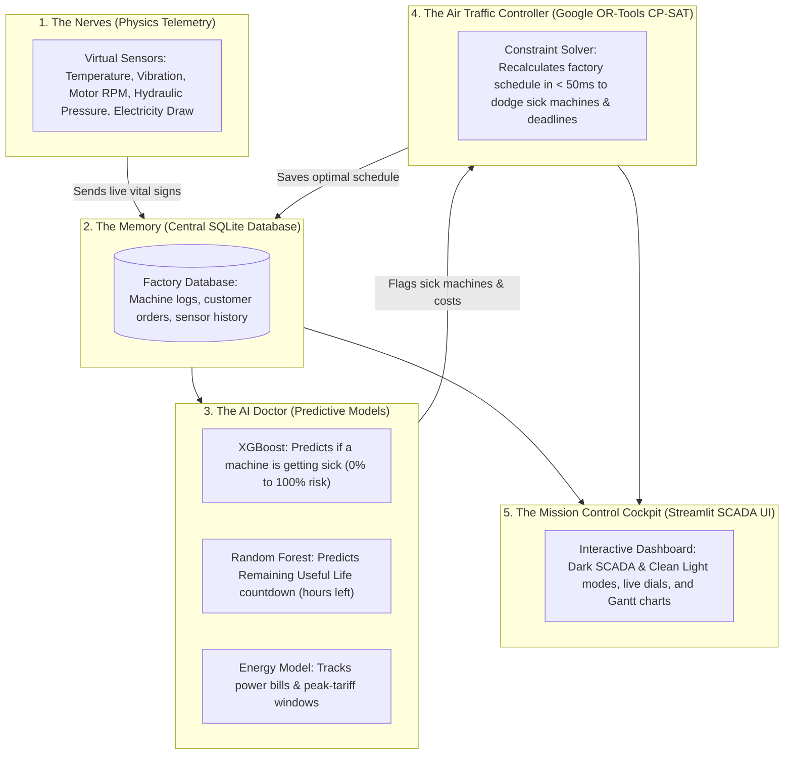
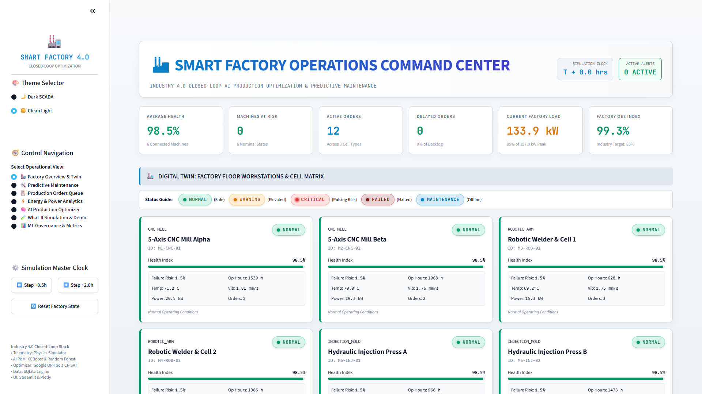

# 🏭 Smart Factory Operations Center | The Complete Plain-English Guide
## How AI, Digital Twins, and Smart Math Run an Industrial Factory with Zero Breakdowns

---

## 🌟 Welcome: What Is This Project & Why Does It Matter?

Imagine running a high-tech manufacturing plant with millions of dollars worth of giant, fast-moving machinery. 

In a traditional factory, unexpected breakdowns are an everyday nightmare:
- A machine suddenly overheats or snaps a bearing mid-shift.
- Urgent customer orders are trapped on the broken machine.
- Deliveries are delayed, customers get angry, and penalty fees start piling up.
- Meanwhile, electric utility bills skyrocket because power-hungry machines were running during peak afternoon electricity hours.

This project is a **software "Digital Twin" and AI Brain** that solves all of those problems at once. It acts like a **smart fitness tracker, an AI doctor, and an air traffic controller for a factory floor**:

1. **Like a Smart Fitness Tracker (IoT Telemetry)**: Virtual sensors continuously monitor the "vital signs" of every machine (temperature, vibration, motor speed, hydraulic pressure, and electricity draw).
2. **Like an AI Doctor (Machine Learning PdM)**: Machine learning models (XGBoost & Random Forest) spot tiny microscopic warning signs hours before a machine fails, predicting failure risk and how many healthy operating hours are left.
3. **Like an AI Air Traffic Controller (Google OR-Tools CP-SAT)**: When a machine gets sick or a rush customer order arrives, a mathematical solver recalculates the entire factory schedule in **under 50 milliseconds**. It moves orders to healthy sister machines, avoids late penalties, and shifts energy-heavy jobs away from expensive electricity hours.

Let's explore every screen, button, metric, and feature of the system in simple, everyday language!

---

## 🏛️ How the System Works: The 5-Layer Nervous System

Think of the system as an artificial human body:



1. **The Nerves (Physics Telemetry)**: Every machine constantly reports its physical readings.
2. **The Memory (SQLite Database)**: Records every second of data, past repair jobs, and customer delivery orders.
3. **The AI Doctor (Predictive Maintenance Models)**: Checks the vitals every 30 minutes to see if any machine is showing early wear or fever.
4. **The Air Traffic Controller (Google OR-Tools CP-SAT)**: When trouble is detected, it reroutes jobs away from sick machines onto healthy machines in less than the blink of an eye.
5. **The Mission Control Cockpit (SCADA Dashboard)**: A modern web interface where supervisors, engineers, and executives can watch and control everything.

---

## 🧭 Global Master Controls & Top SCADA Command Bar

No matter which page you are on, the **Sidebar** on the left and the **SCADA Command Bar** across the top are always available.

### 1. The Left Sidebar Master Controls

| Control | Type | What It Does (In Plain English) | Why We Use It |
| :--- | :--- | :--- | :--- |
| **🎨 Theme Selector** | Radio Toggle | Toggles between **`🌙 Dark SCADA`** and **`☀️ Clean Light`**. | Dark mode is easy on the eyes during 12-hour night shifts in control rooms; Light mode looks crisp and clean for executive presentations in bright boardrooms. |
| **🧭 Control Navigation** | Radio List | Lets you switch between the 7 specialized operational screens of the factory. | Lets different people (technicians, planners, energy managers, data scientists) jump to their specific workspace. |
| **⏩ Step +0.5h** | Action Button | Fast-forwards the factory clock by **30 minutes**. | You don't want to sit around for 8 hours waiting to see how a machine ages. This button jumps forward half an hour, updating temperatures, wear, and order progress. |
| **⏩ Step +2.0h** | Action Button | Fast-forwards the factory clock by **2 full hours**. | Quickly simulates a quarter of an entire working shift to observe shift handovers or watch a machine breakdown develop. |
| **🔄 Reset Factory State** | Action Button | Cleans the slate: restores all 6 machines to $100\%$ health, resets sensor readings, and restores the original schedule. | Gives you a clean reset button whenever you finish testing chaos or want to start a fresh demo. |

---

### 2. The Top SCADA Command Bar & Real-Time KPI Cards

Across the very top of every screen sits the factory's main status bar:

- **SIMULATION CLOCK (`T + X.X hrs`)**: Shows how many hours the factory has been running since the start of the simulation.
- **ACTIVE ALERTS Beacon**:
  - 🟢 **`0 ACTIVE` (Emerald Green)**: All machines are running smoothly within safe limits.
  - 🔴 **`X ACTIVE` (Pulsing Crimson Red)**: A siren warning that one or more machines are in Warning, Critical, or Halted state.

Directly underneath are the **6 Master KPI Cards**:

1. **Average Health (`Average Health`)**: The average physical condition score of all 6 machines ($0\% - 100\%$). Think of this like the overall fitness score of your fleet.
2. **Machines At Risk (`Machines At Risk`)**: How many machines have a failure risk above $30\%$ or health score below $65\%$. If this says 0, you're in great shape!
3. **Active Orders (`Active Orders`)**: The total number of customer batches currently in the factory queue.
4. **Delayed Orders (`Delayed Orders`)**: How many customer orders are currently projected to miss their promised delivery cutoff. Keeping this at **0** is the #1 priority of the plant.
5. **Current Factory Load (`Current Factory Load`)**: Total electricity being drawn right now in kilowatts ($\text{kW}$), compared against the factory's substation safety ceiling ($157.0\text{ kW}$).
6. **Factory OEE Index (`Factory OEE Index`)**: Overall Equipment Effectiveness. The gold-standard manufacturing metric combining machine health and on-time delivery against the world-class target of $85\%$.

---

## 📸 Visual Tour: The 7 Core Operational Screens

Let's walk through all 7 operational screens step-by-step with high-resolution screenshots.

---

### Screen 1: 🏭 Factory Floor Overview & Digital Twin

**Where to find it**: Select `🏭 Factory Overview & Twin` in the sidebar.

This screen is your **digital bird's-eye view of the factory floor**. It shows all 6 heavy-duty workstations arranged in 3 manufacturing cells:


#### Meet the 6 Factory Workstations:
- **`M1-CNC-01` (CNC Mill Alpha)**: 5-Axis precision milling machine. Carves titanium aerospace turbine blades at up to $12,000\text{ RPM}$.
- **`M2-CNC-02` (CNC Mill Beta)**: Sister 5-Axis milling machine. Handles automotive engine blocks at up to $10,000\text{ RPM}$.
- **`M3-ROB-01` (Robotic Welder Cell 1)**: 6-Axis robotic arm that welds electric vehicle chassis sub-frames.
- **`M4-ROB-02` (Robotic Welder Cell 2)**: Sister 6-Axis robotic arm that assembles robotic precision gearboxes.
- **`M5-INJ-01` (Injection Press A)**: High-pressure hydraulic press that molds medical syringe casings under $140\text{ bar}$ of pressure.
- **`M6-INJ-02` (Injection Press B)**: Sister hydraulic press that molds precision polymer electronic enclosures.

#### Understanding the Machine Cards & Status Badges:
Each machine has a color-coded status badge with a live pulsing dot:
- 🟢 **`NORMAL` (Emerald Green)**: Everything is safe and operating within healthy engineering tolerances.
- 🟡 **`WARNING` (Amber Orange)**: The AI has detected an unusual vibration, temperature rise, or pressure drop. Not broken yet, but needs watching!
- 🔴 **`CRITICAL` (Crimson Red with pulsing beacon)**: Imminent breakdown within hours! Operating here will cause irreversible machine damage.
- 🛑 **`FAILED` (Dark Maroon)**: Machine has seized or suffered a catastrophic halt. Production has completely stopped.
- 🔵 **`MAINTENANCE` (Royal Blue)**: Machine is safely offline while human technicians perform a scheduled overhaul.

Inside each card, you can also see:
- **Health Index Bar**: Green ($\ge 80\%$), Amber ($55\% - 79\%$), or Red ($< 55\%$).
- **Failure Risk**: The AI-calculated probability of failure ($0.0\% - 100\%$).
- **Live Vitals**: Temperature (°C), Vibration ($\text{mm/s RMS}$), Power Draw ($\text{kW}$), and how many customer orders are currently assigned.

#### 1-Click Status Simulation & Chaos Buttons:
Under the workstation grid is a control bar where you can select any machine and test how the factory responds to real-world mechanical disasters:
- **🔥 `Coolant Spike`**: Simulates a radiator pump failure. Spindle temperature climbs rapidly past $100^\circ\text{C}$ into **CRITICAL** state.
- **⚡ `Bearing Wear`**: Simulates a cracked ball bearing. High-frequency vibration surges into **WARNING** state.
- **⚙️ `Motor Misalign`**: Simulates a loose motor mount causing rotational wobble.
- **💥 `Breakdown`**: Triggers a sudden emergency halt (**FAILED** state).
- **🔧 `Maintenance`**: Sends the machine offline for a 2-hour overhaul.
- **🛠️ `Restore Machine`**: Dispatches the repair team to immediately fix the machine back to $98.5\%$ pristine health!

---

### Executive Showcase: ☀️ Clean Light Theme

**Where to find it**: Select `☀️ Clean Light` under the Theme Selector in the sidebar.



With a single click, the entire interface transforms into a bright, modern executive palette. All fonts, Plotly charts, status borders, and metric cards seamlessly restyle themselves, giving plant directors a presentation-ready view for daylit conference rooms.

---

### Screen 2: 🛠️ Predictive Maintenance & Health Diagnostics

**Where to find it**: Select `🛠️ Predictive Maintenance` in the sidebar.

This screen is the **AI Diagnostic Workshop**. It gives maintenance engineers an x-ray view inside any selected machine.


#### 1. The Top AI Prognostic Dials:
- **Machine Health Index**: A circular dial showing physical condition from $0\%$ (dead) to $100\%$ (factory-fresh).
- **Failure Probability (ML)**: The live risk assessment calculated by the **XGBoost AI model**. If this needle moves into the red ($> 60\%$), the AI knows a failure is brewing.
- **Status & RUL Prognosis Box**:
  - **Estimated Remaining Useful Life (RUL)**: A countdown in operating hours (e.g., `543 Operating Hours`) calculated by a **Random Forest model**. Think of this like the remaining battery percentage on your smartphone!
  - **Primary Degradation Cause**: Plain-English diagnosis telling technicians *why* the machine is sick (e.g., *"High Temp (104.7°C), Excessive Vibration (5.38 mm/s)"*).

#### 2. The 5 Physical Telemetry Sensors & Live Gauges:
Scroll down slightly to view the 5 circular gauges that monitor physical laws in real time:


1. **Temperature (°C)**: Normal is $60-70^\circ\text{C}$. Turns red if it exceeds $85^\circ\text{C}$.
2. **Vibration (mm/s RMS)**: Measures how smoothly the motor rotates. Normal is $< 2.0\text{ mm/s}$. If it spikes past $3.5\text{ mm/s}$, bearings are vibrating loose.
3. **Motor Spindle (RPM)**: Rotational speed of the cutting head or pump.
4. **Hydraulic Pressure (bar)**: Measures hydraulic fluid force. Normal is $100-140\text{ bar}$. A drop indicates seal leaks.
5. **Power Draw (kW)**: How much electricity the machine is pulling right now.
6. **AI Prescriptive Maintenance Banner**: Clear, actionable advice telling the maintenance crew exactly what to inspect (e.g., *"Inspect coolant reservoir, verify circulation pump, clear intake filters"*).

---

### Screen 3: 📋 Production Orders Queue & Backlog

**Where to find it**: Select `📋 Production Orders Queue` in the sidebar.

This screen is the **Production Planner's Command Desk**. It tracks every customer order moving through the factory.


#### 1. Understanding the Backlog Table:
Every row is a real production batch:
- **Order ID**: Tracking code (e.g., `ORD-102`).
- **Product**: What is being made (e.g., *Inconel Exhaust Nozzle*, *EV Chassis Sub-frame*, *Medical Venturi Manifold*).
- **Machine Type**: The kind of machine needed (`CNC_MILL`, `ROBOTIC_ARM`, `INJECTION_MOLD`).
- **Priority**: How important the customer is (`Urgent` = rush order with heavy delivery fines, `High`, `Medium`, `Low`).
- **Remaining Time (hrs)**: How much machining time is left.
- **Deadline**: When the customer expects delivery (e.g., `T + 8.0 h`).
- **Schedule Risk Badge**:
  - 🟢 **`✅ ON TIME`**: The order is scheduled to finish well ahead of its deadline.
  - 🟡 **`⚠️ AT RISK`**: Machine is degrading or queue is tight; order might be delayed.
  - 🔴 **`⚠️ LATE`**: In the current schedule, this order will miss its promised delivery cutoff!

#### 2. Dispatch New Production Order Form:
At the bottom of this screen, supervisors can enter a brand-new customer order:
- Pick the product from the catalog.
- Set the batch quantity and required machining hours.
- Choose priority (`Urgent`, `High`, `Medium`, `Low`).
- Set the customer delivery deadline.
- Click **`🚀 Submit Order to Shop Floor Backlog`** to inject the job into the factory queue.

---

### Screen 4: ⚡ Energy Consumption & Power Analytics

**Where to find it**: Select `⚡ Energy & Power Analytics` in the sidebar.

Electricity is one of a factory's biggest monthly expenses. This screen helps operators **cut utility bills and avoid expensive peak power hours**.


#### 1. Key Energy Cards:
- **Total Factory Load**: Current electricity draw in $\text{kW}$ vs. the plant's maximum safety limit ($157\text{ kW}$).
- **Cumulative Energy Consumed**: Total kilowatt-hours ($\text{kWh}$) used today.
- **Cumulative Energy Cost**: The actual electricity bill in dollars ($) based on utility rates.
- **Degradation Energy Loss**: Extra power wasted purely because worn-out bearings create friction!
  > *Analogy: Think of a rusty bicycle chain—you have to pedal twice as hard to go the same speed. A worn machine pulls up to $22\%$ more electricity just fighting its own friction!*

#### 2. The 24-Hour Load Profile & Peak Tariff Red Zone:
Look at the line chart on the right:
- **Off-Peak Electricity Rate ($0.11/kWh)**: Late night and morning hours are cheap.
- **Peak Electricity Tariff Window (14:00 to 19:00, shaded in crimson)**: Between 2:00 PM and 7:00 PM, commercial power costs **$0.28/kWh**—that is **2.5 times more expensive!**
- The AI optimizer uses this window to automatically schedule power-heavy jobs in the morning or evening, saving thousands of dollars per month.

---

### Screen 5: 🧠 AI Production Optimizer Studio

**Where to find it**: Select `🧠 AI Production Optimizer` in the sidebar.

This screen is the **Crown Jewel of the Entire System**. It uses **Google OR-Tools CP-SAT**, an industrial-grade mathematical constraint solver, to solve complex scheduling puzzles in milliseconds.


#### The Problem the AI Solves in 50 Milliseconds:
Imagine having 12 customer orders with different deadlines, 6 machines with different speeds, some machines getting sick, and electricity prices spiking at 2:00 PM. A human planner would take hours with a spreadsheet to figure out the best schedule.

Google OR-Tools balances all 4 goals at once:
1. **Goal 1 (Never Be Late)**: Prioritize urgent orders so no customer deadline is blown.
2. **Goal 2 (Protect Sick Machines)**: If a machine has high failure risk ($P_{\text{fail}} > 35\%$), evacuate jobs off that machine onto healthy peer machines.
3. **Goal 3 (Slash Electric Bills)**: Avoid scheduling power-hungry batches during the expensive 2 PM – 7 PM peak tariff window.
4. **Goal 4 (Finish Fast)**: Keep machines balanced so the entire backlog is completed as early as possible.

#### Before vs. After Results Proof:
Click the big blue button: **`🚀 Run AI Production Optimization`**. In less than $50\text{ milliseconds}$, the solver displays:
- **Weighted Tardiness**: Delay hours eliminated (e.g., from 18.5 hours late $\rightarrow$ **0.0 hours**).
- **Jobs on Degraded Machines**: High-risk jobs evacuated (e.g., from 4 high-risk jobs $\rightarrow$ **0 jobs**).
- **Late Orders Count**: Number of late customer shipments drops to **0**!
- **Total Energy Saved**: Kilowatt-hours conserved by avoiding friction wear and peak tariffs.

#### The Visual Shop Floor Gantt Schedule:
Scroll down to see the visual timeline across all 6 workstations:


- Each horizontal bar represents a customer job scheduled on a specific machine.
- Green bars are safe and on-track; amber bars indicate tight turnaround.
- Underneath, the **Schedule Assignment Comparison Table** shows exactly which orders were moved (e.g., shifted from failing machine `M1` to healthy sister machine `M2`).

---

### Screen 6: 🧪 What-If Simulation & Guided Demonstration

**Where to find it**: Select `🧪 What-If Simulation & Demo` in the sidebar.

This screen provides two ways to explore factory resilience: a **10-Step Guided Story** and an **Interactive Chaos Sandbox**.

#### Tab 1: 🚀 10-Step Guided Demonstration Flow
A step-by-step interactive presentation stepper that walks you through the entire closed-loop Industry 4.0 lifecycle:


1. **Step 1**: Start with all 6 machines in pristine, healthy condition.
2. **Step 2**: Advance the simulation clock to begin cutting and welding parts.
3. **Step 3**: Inject a coolant loss and vibration anomaly onto machine `M1-CNC-01`.
4. **Step 4**: Watch the AI model detect the sensor spikes and flag a failure risk above $85\%$.
5. **Step 5**: Machine `M1-CNC-01` enters **CRITICAL** alarm state.
6. **Step 6**: Customer orders queued on `M1` immediately flag high delay risk.
7. **Step 7**: Click to trigger automated Google OR-Tools CP-SAT rescheduling.
8. **Step 8**: The solver evacuates orders from sick machine `M1` to healthy sister machine `M2`.
9. **Step 9**: Before vs. After comparison cards prove all delays and risks were eliminated.
10. **Step 10**: Confetti celebration! The complete closed-loop self-healing cycle is verified!

---

#### Tab 2: 🎛️ Interactive What-If Scenario Sandbox
Want to test your own custom scenarios? Switch to the Sandbox tab:


- **Machine Scenarios**: Pick any machine and click `Coolant Loss`, `Bearing Wear`, `Sudden Breakdown`, or `Service / Restore`.
- **Market Scenarios**: Click **`📦 Surge Rush Customer Orders (+3 Urgent Orders)`** to simulate an emergency rush delivery.
- **Tariff Scenarios**: Click **`⚡ Simulate Peak Energy Tariff Window`** to force jobs to avoid the 2 PM – 7 PM window.
- **Factory Reset**: Click **`🔄 Reset Entire Factory & Database`** to wipe anomalies and start fresh.

---

### Screen 7: 📊 AI Model Governance & Metrics

**Where to find it**: Select `📊 ML Governance & Metrics` in the sidebar.

In real-world manufacturing, you cannot trust an AI "black box" without proof. This screen provides **complete transparency and governance** over the predictive models.


#### 1. The AI Scorecard (Audited Test Set):
- **Accuracy (99.69%)**: Overall percentage of correct health classifications.
- **Precision (99.09%)**: Virtually zero false alarms! The AI will never cry wolf and interrupt factory production needlessly.
- **Recall (98.64%)**: Catches over $98.6\%$ of all impending breakdowns before they happen.
- **ROC-AUC (0.9993)**: Near-perfect score proving the AI can cleanly distinguish healthy machines from failing machines.

#### 2. What Physical Clues Does the AI Listen to Most?
The **Feature Importance Ranking** chart reveals what physical signals the XGBoost model cares about:
1. **Vibration (48.6%)**: The #1 telltale sign of failing bearings and rotor balance.
2. **Temperature (27.8%)**: Vital for detecting coolant clogs and friction overheating.
3. **Hydraulic Pressure (12.4%)**: Critical for catching hydraulic press valve leaks.
4. **Operating Hours (8.6%)**: Natural wear and tear over time.
5. **Power Draw (1.6%)**: Electrical surge when motors struggle against friction.

#### 3. On-Demand Browser Retraining Pipeline:
Want to retrain the AI models with fresh data?
1. Adjust the slider **`Synthetic Dataset Size for Retraining`** (e.g., 6,000 to 10,000 samples).
2. Click **`🚀 Retrain Models Now`**.
3. The system generates fresh physics telemetry, trains new XGBoost and Random Forest models, updates the confusion matrix, and hot-reloads the new models into the running dashboard—all right inside your browser!

---

## 🎮 3 Fun Hands-On Experiments You Can Try Right Now!

Here are 3 quick walkthroughs that will prove how smart the factory is:

---

### Experiment 1: The Broken Machine Rescue
**Goal**: Break machine `M1-CNC-01` and watch the AI scheduler automatically rescue queued customer orders.

1. In the sidebar, click **`🔄 Reset Factory State`** to make sure everything is clean.
2. Click **`🧪 What-If Simulation & Demo`** in the sidebar, and switch to the **`🎛️ Interactive What-If Scenario Sandbox`** tab.
3. Under **Target Machine**, select **`M1-CNC-01`**.
4. Click **`⚡ Bearing Wear on M1-CNC-01`**.
5. Switch to **`🏭 Factory Overview & Twin`**:
   - Notice `M1-CNC-01` now has a pulsing red **`CRITICAL`** badge.
   - Vibration has surged past $5.0\text{ mm/s RMS}$.
   - Failure risk has jumped past $85\%$.
6. Switch to **`📋 Production Orders Queue`**:
   - Notice orders queued on `M1` now show yellow **`⚠️ AT RISK`** or red **`⚠️ LATE`** badges!
7. Switch to **`🧠 AI Production Optimizer`**:
   - Notice the unoptimized schedule shows late orders.
   - Click **`🚀 Run AI Production Optimization`**.
   - **Watch the magic**: In $< 50\text{ ms}$, the solver evacuates all orders off sick machine `M1` and gives them to healthy sister machine `M2`.
   - Late orders drop to **$0$**!
8. Switch back to **`🏭 Factory Overview`**, select `M1-CNC-01`, and click **`🛠️ Restore M1`** to simulate the repair crew fixing the machine.

---

### Experiment 2: The Rush Order Surprise
**Goal**: Inject surprise high-priority orders and let the AI fit them in without blowing existing deadlines.

1. Reset the factory state via the sidebar (**`🔄 Reset Factory State`**).
2. Go to **`🧪 What-If Simulation & Demo`** $\rightarrow$ **`🎛️ Interactive What-If Scenario Sandbox`**.
3. Click **`📦 Surge Rush Customer Orders (+3 Urgent Orders)`**.
4. Go to **`📋 Production Orders Queue`**:
   - You will see 3 brand-new `Urgent` orders added with tight deadlines.
   - Several existing orders now flag as **`⚠️ LATE`** because the queue is crowded.
5. Go to **`🧠 AI Production Optimizer`** and click **`🚀 Run AI Production Optimization`**:
   - The solver prioritizes the high-value urgent orders, spreads the remaining jobs across other workstations, and brings late orders back to **$0$**!

---

### Experiment 3: Changing the Control Room Theme
**Goal**: Switch between day and night operational modes.

1. Look at the top of the left sidebar.
2. Under **`🎨 Theme Selector`**, click **`☀️ Clean Light`**.
3. Notice how all backgrounds, fonts, cards, and Plotly charts instantly transform into an executive daylight palette.
4. Click **`🌙 Dark SCADA`** to return to the industrial mission control mode.

---

## 🛠️ Quick-Start: How to Run Everything Locally

### 1. Prerequisites
- **Python 3.10, 3.11, or 3.12** installed on your computer.
- A modern web browser (Google Chrome, Edge, Firefox).

### 2. Installation
Open your terminal or PowerShell in the project directory:

```bash
# 1. Install required packages
pip install -r requirements.txt

# 2. Run the automated test verification suite (all 21 tests pass)
python test_system.py

# 3. Launch the dashboard
streamlit run app.py
```

The application will open automatically in your browser at:
`http://localhost:8501`

### 3. Generate Screenshots Automatically
To re-capture all 11 pixel-perfect screenshots:

```bash
python capture_all_screenshots.py
```

---

## ❓ Frequently Asked Questions (FAQ) in Everyday Language

### Q1: Is this running real machines or a simulation?
**A:** This is a **software Digital Twin**. It uses real physics formulas (heat transfer, motor vibration, hydraulic pressure curves) to simulate realistic machine behavior. If you wanted to connect this to real physical machines, you would simply plug in standard industrial protocols like **OPC-UA** or **MQTT** instead of the simulation generator. The AI brain and scheduler would work exactly the same!

### Q2: Why does Google OR-Tools solve the schedule so fast (< 50 milliseconds)?
**A:** Google OR-Tools CP-SAT is one of the fastest constraint programming engines in the world. Instead of randomly guessing schedules, it uses advanced mathematical logic to eliminate millions of bad schedules instantly, zeroing in on the best one in milliseconds.

### Q3: What happens if a machine breaks and there's no backup machine?
**A:** If both machines of a certain type are down (for example, both CNC mills are broken), the optimizer prioritizes orders by customer importance (`Urgent` > `High` > `Medium` > `Low`) and schedules them the second the first machine finishes its repair, keeping delay penalties as low as mathematically possible.

### Q4: What makes this better than a traditional spreadsheet schedule?
**A:** Spreadsheets are static. They don't know that machine M1 has a high temperature, they don't know that electricity costs 2.5x more at 3 PM, and they can't recalculate thousands of permutations in 50 milliseconds when an emergency happens. This system connects machine health directly to the production schedule automatically.

---

*Smart Factory Operations Center &middot; Industry 4.0 Digital Twin & Autonomous Decision Support System.*
