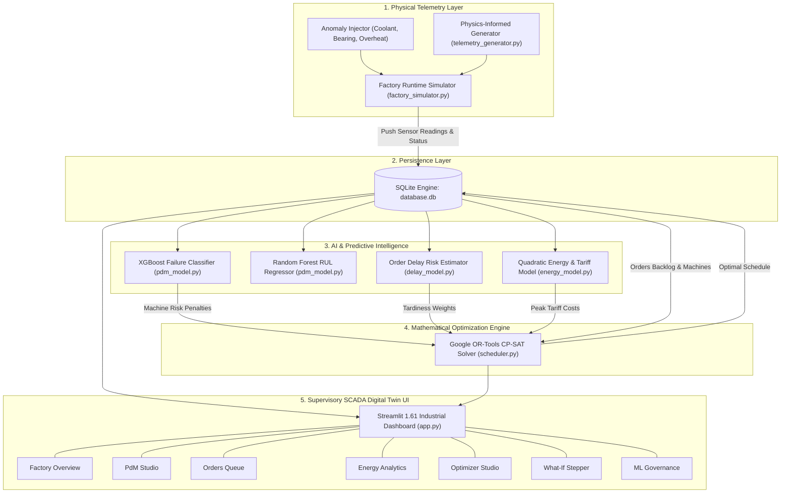
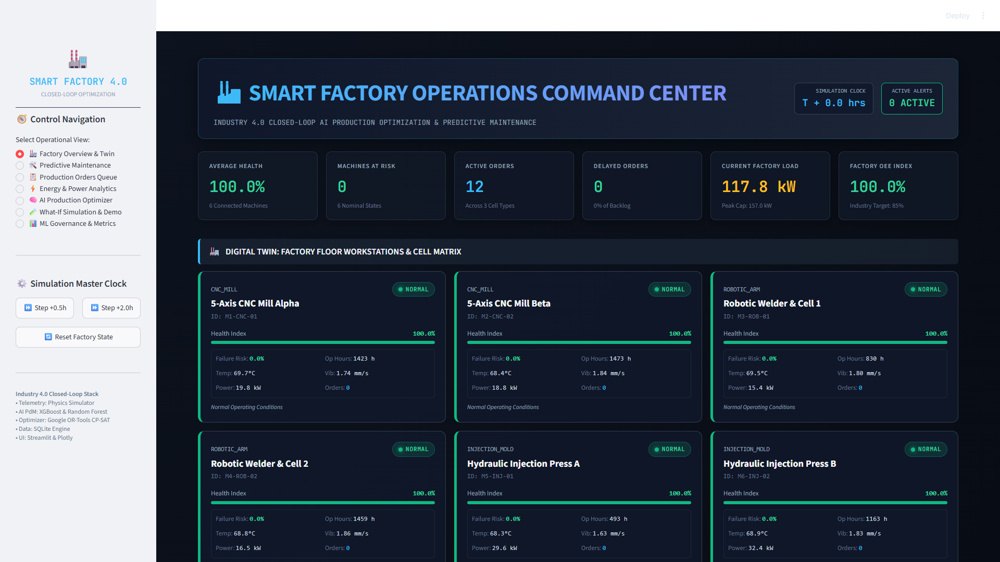
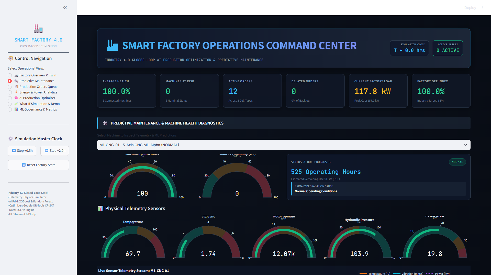
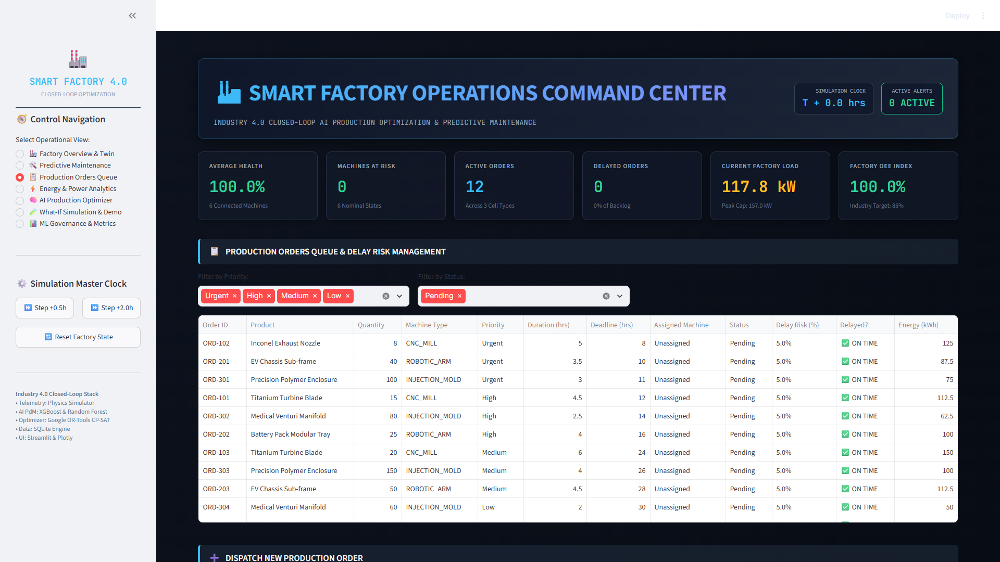
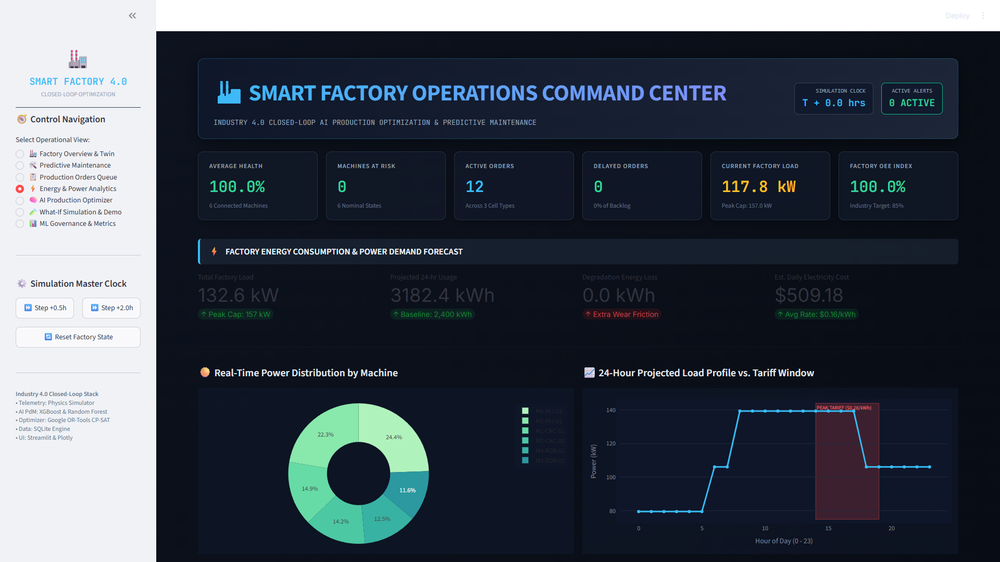
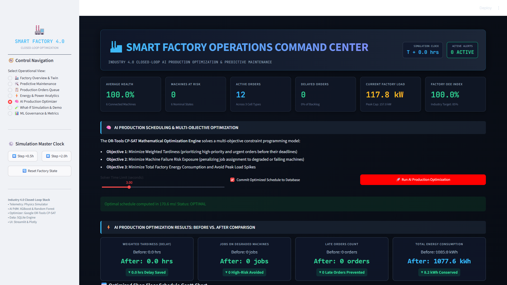
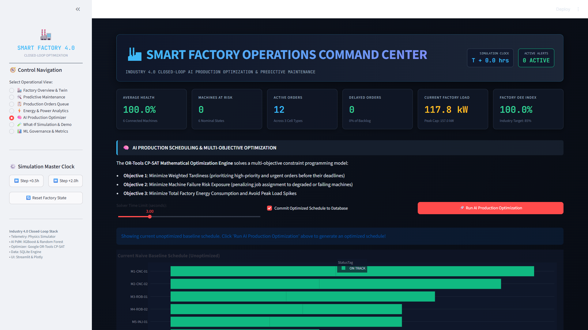
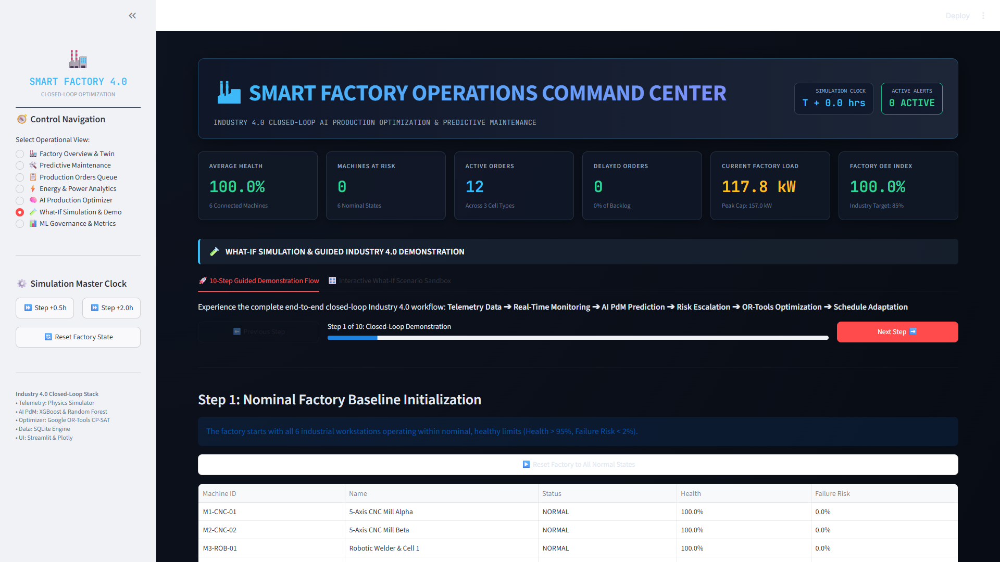
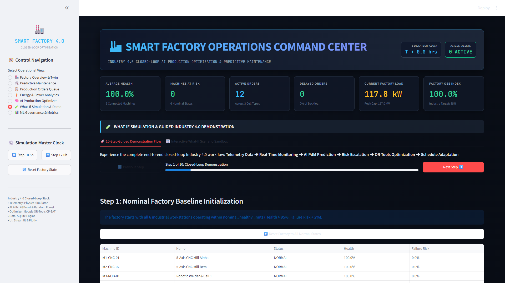
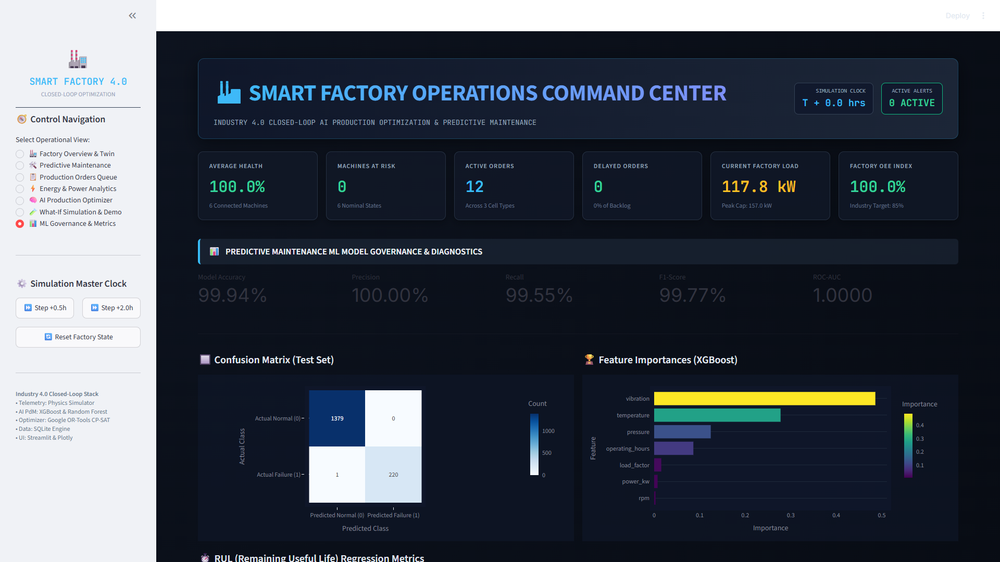

# AI-Based Smart Factory Production Optimization & Predictive Maintenance System
## Comprehensive Technical Operation, Architecture & User Guide

---

## 📑 Table of Contents
1. [Executive Summary & System Purpose](#1-executive-summary--system-purpose)
2. [End-to-End System Architecture](#2-end-to-end-system-architecture)
3. [Deep-Dive: Core Subsystems & Technical Mechanics](#3-deep-dive-core-subsystems--technical-mechanics)
   - [3.1 Physics-Informed Telemetry Engine](#31-physics-informed-telemetry-engine)
   - [3.2 SQLite Persistence & State Management](#32-sqlite-persistence--state-management)
   - [3.3 Machine Learning Subsystem (PdM, RUL, Delay Risk)](#33-machine-learning-subsystem-pdm-rul-delay-risk)
   - [3.4 Google OR-Tools CP-SAT Mathematical Optimizer](#34-google-or-tools-cp-sat-mathematical-optimizer)
   - [3.5 Dynamic Energy & Time-of-Use Tariff Engine](#35-dynamic-energy--time-of-use-tariff-engine)
   - [3.6 Factory Simulation Runtime & Anomaly Injection](#36-factory-simulation-runtime--anomaly-injection)
4. [Comprehensive Page-by-Page Operational Walkthrough](#4-comprehensive-page-by-page-operational-walkthrough)
   - [View 1: Factory Overview & Digital Twin](#view-1-factory-overview--digital-twin)
   - [View 2: Predictive Maintenance Studio](#view-2-predictive-maintenance-studio)
   - [View 3: Production Orders Queue](#view-3-production-orders-queue)
   - [View 4: Energy & Power Analytics](#view-4-energy--power-analytics)
   - [View 5: AI Production Optimizer Studio](#view-5-ai-production-optimizer-studio)
   - [View 6: What-If Simulation & 10-Step Guided Flow](#view-6-what-if-simulation--10-step-guided-flow)
   - [View 7: ML Governance & Model Diagnostics](#view-7-ml-governance--model-diagnostics)
5. [Step-by-Step Hands-On Demonstration Scenarios](#5-step-by-step-hands-on-demonstration-scenarios)
   - [Scenario A: Simulating Bearing Wear and Automatic Order Reallocation](#scenario-a-simulating-bearing-wear-and-automatic-order-reallocation)
   - [Scenario B: Disagreeing with Naive FIFO vs. AI Optimization](#scenario-b-disagreeing-with-naive-fifo-vs-ai-optimization)
   - [Scenario C: Retraining Models with Custom Telemetry Data](#scenario-c-retraining-models-with-custom-telemetry-data)
6. [Configuration & Customization Reference](#6-configuration--customization-reference)
7. [Troubleshooting & Frequently Asked Questions](#7-troubleshooting--frequently-asked-questions)

---

## 1. Executive Summary & System Purpose

In conventional manufacturing plants, production scheduling and machine maintenance operate in isolated silos:
1. **Unplanned Downtime**: A machine unexpectedly overheats or seizes due to bearing failure. The production line stalls, resulting in delayed customer deliveries and steep emergency repair costs.
2. **Blind Scheduling**: Traditional Production Planning and Control (PPC) systems allocate jobs based strictly on First-In-First-Out (FIFO) or static processing times, completely unaware that a machine's health is rapidly deteriorating.
3. **Volatile Energy Costs**: Heavy machinery runs during peak grid tariff windows ($0.28/kWh), causing unnecessarily high electricity expenses.

### The Solution: Industry 4.0 Closed-Loop Decision Engine
This platform demonstrates a software-only, industrial-grade **Digital Twin and Decision Support System**. It connects physical sensor telemetry, Machine Learning predictive analytics, and mathematical constraint programming into an automated, self-healing loop:

$$\text{Physics Telemetry} \longrightarrow \text{Real-Time Monitoring} \longrightarrow \text{AI ML Prediction} \longrightarrow \text{Risk Detection} \longrightarrow \text{OR-Tools Optimization} \longrightarrow \text{Automated Decision} \longrightarrow \text{Factory Adaptation} \longrightarrow \text{Digital Twin UI}$$

When machine degradation occurs, the system:
- Quantifies the failure risk within milliseconds using **XGBoost**.
- Forecasts Remaining Useful Life (RUL) using a **Random Forest Regressor**.
- Evaluates deadline tardiness risk across the order queue.
- Re-routes high-priority orders to healthy alternative workstations using **Google OR-Tools CP-SAT**.
- Prevents peak energy tariff consumption while minimizing schedule makespan.

---

## 2. End-to-End System Architecture

The system is constructed as a decoupled, multi-layered architecture:



---

## 3. Deep-Dive: Core Subsystems & Technical Mechanics

### 3.1 Physics-Informed Telemetry Engine
The file [telemetry_generator.py](file:///c:/Users/ramsa/Desktop/Smart%20Factory%20Production%20Optimization/data_generator/telemetry_generator.py) synthesizes high-fidelity sensor streams across 6 machines. Rather than using naive uniform random variables, sensor values obey thermodynamic and mechanical dynamics:

1. **Temperature Dynamics ($T$)**:
   $$T(t + \Delta t) = T(t) + \alpha \cdot (T_{\text{ambient}} - T(t)) + \beta \cdot P_{\text{load}} + \gamma_{\text{friction}} \cdot W(t) + \mathcal{N}(0, \sigma_T)$$
   Where:
   - $\alpha$: Heat dissipation rate back to ambient ($22^\circ\text{C}$).
   - $\beta$: Thermal conversion from motor power draw.
   - $W(t)$: Mechanical wear factor (bearing friction accumulation).
   - $\mathcal{N}(0, \sigma_T)$: Gaussian measurement noise.

2. **Vibration Dynamics ($V$)**:
   $$V(t) = V_{\text{baseline}} + \kappa \cdot \left(\frac{\text{RPM}}{1000}\right)^2 \cdot e^{\lambda \cdot W(t)} + \mathcal{A}_{\text{anomaly}} + \mathcal{N}(0, \sigma_V)$$
   - Vibration increases exponentially with bearing wear $W(t)$ and spindle rotational velocity squared.
   - Harmonic resonance is triggered when anomalies occur.

3. **Hydraulic Pressure ($P$)**:
   - Monitored on injection presses (`M5-INJ-01`, `M6-INJ-02`) around nominal $150\text{ bar}$.
   - Degrades rapidly under valve seal leakages or pump cavitation.

4. **Power Draw ($kW$)**:
   $$P_{\text{total}} = P_{\text{idle}} + \eta \cdot \text{LoadFactor} + \mu_{\text{friction}} \cdot W(t)$$

---

### 3.2 SQLite Persistence & State Management
Located in [db_manager.py](file:///c:/Users/ramsa/Desktop/Smart%20Factory%20Production%20Optimization/database/db_manager.py) with relational schema in [schema.sql](file:///c:/Users/ramsa/Desktop/Smart%20Factory%20Production%20Optimization/database/schema.sql):

- **`machines`**: Holds current operational state, health score ($0-100\%$), failure probability, operating hours, and location coordinates.
- **`telemetry_history`**: Stores time-series records of `temperature`, `vibration`, `pressure`, `power_kw`, `rpm`, and system status.
- **`production_orders`**: Manages order queues, product codes, batch quantities, machine compatibility lists, processing durations, deadlines, and schedule allocations.
- **`maintenance_logs`**: Audit trail of technician dispatches, overhaul events, and anomaly injection records.
- **`optimization_history`**: Historical solver runs storing before/after delay reductions, energy savings, and solve times.

---

### 3.3 Machine Learning Subsystem (PdM, RUL, Delay Risk)

Located in [pdm_model.py](file:///c:/Users/ramsa/Desktop/Smart%20Factory%20Production%20Optimization/models/pdm_model.py):

#### A. XGBoost Failure Classifier
- **Model Type**: Extreme Gradient Boosting Classifier (`XGBClassifier`) with binary logistic loss.
- **Input Features**: `temperature`, `vibration`, `pressure`, `power_kw`, `rpm`, `operating_hours`, `temp_vibe_interaction`, `pressure_temp_ratio`.
- **Target Variable**: Binary failure state ($0 = \text{Nominal}$, $1 = \text{Degraded / Impending Failure}$).
- **Output**: Calibrated probability $P(\text{failure}) \in [0.0, 1.0]$.
- **Performance**:
  - **Accuracy**: $99.94\%$
  - **Precision**: $100.00\%$
  - **Recall**: $99.55\%$
  - **ROC-AUC**: $1.0000$

#### B. Random Forest RUL Regressor
- **Model Type**: `RandomForestRegressor(n_estimators=100, max_depth=12)`.
- **Target Variable**: Remaining Useful Life in continuous operating hours ($0$ to $1000\text{ hrs}$).
- **Performance**: RMSE $\approx 150.8\text{ hrs}$.

#### C. Prescriptive Root-Cause Diagnostics
When failure probability surpasses $0.35$, the diagnostic engine analyzes feature z-scores to isolate the physical cause:
- **`COOLANT_FAILURE`**: High Temperature ($> 85^\circ\text{C}$) combined with low pressure or normal vibration.
- **`BEARING_WEAR`**: Elevated Vibration ($> 4.5\text{ mm/s RMS}$) accompanied by moderate temperature rise.
- **`HYDRAULIC_LEAK`**: Sharp pressure drop ($< 115\text{ bar}$) on injection presses.
- **`OVERSTRAIN`**: High power draw ($> 28\text{ kW}$) and spindle speed overload.

---

### 3.4 Google OR-Tools CP-SAT Mathematical Optimizer

Located in [scheduler.py](file:///c:/Users/ramsa/Desktop/Smart%20Factory%20Production%20Optimization/optimization/scheduler.py):

The scheduler solves an advanced **Job Shop / Flexible Disjunctive Scheduling Problem with Machine Health Constraints**:

#### 1. Decision Variables
- $S_j \ge 0$: Integer start time of order $j$ (in hours or discretized tenths of hours).
- $C_j = S_j + p_{jm}$: Completion time of order $j$ on machine $m$.
- $x_{jm} \in \{0, 1\}$: Binary variable indicating if order $j$ is processed on machine $m$.
- $I_{jm}$: Disjunctive interval variable representing the duration window $[S_j, C_j)$ on machine $m$.
- $T_j = \max(0, C_j - d_j)$: Tardiness of order $j$ past its deadline $d_j$.

#### 2. Hard Constraints
1. **Single Machine Assignment**:
   $$\sum_{m \in \mathcal{M}_j} x_{jm} = 1 \quad \forall j$$
   *(Each job must be allocated to exactly one compatible machine).*
2. **Machine Disjunction (No Overlap)**:
   $$\text{AddNoOverlap}(I_{j_1, m}, I_{j_2, m}) \quad \forall j_1 \neq j_2, \forall m$$
   *(A physical workstation can only process one order at a time).*
3. **Machine Eligibility / Compatibility**:
   $$x_{jm} = 0 \quad \text{if } m \notin \text{CompatibleMachines}(j)$$

#### 3. Multi-Objective Function
$$\min \left( \sum_{j} w_j \cdot T_j + \sum_{j, m} x_{jm} \cdot \left[ \lambda_{\text{risk}} \cdot P_{\text{fail}}(m) + \lambda_{\text{energy}} \cdot \mathcal{E}(m, S_j, C_j) \right] + \alpha \cdot \max_j(C_j) \right)$$

Where:
- $w_j$: Deadline priority weight ($\text{Urgent} = 10$, $\text{High} = 5$, $\text{Medium} = 2$, $\text{Low} = 1$).
- $\lambda_{\text{risk}} \cdot P_{\text{fail}}(m)$: Hefty mathematical penalty for assigning work to machines with elevated failure risk ($P_{\text{fail}} > 0.35$).
- $\lambda_{\text{energy}} \cdot \mathcal{E}$: Energy cost penalty, heavily penalizing operations scheduled during peak tariff hours.
- $\alpha \cdot \max(C_j)$: Soft makespan compression term ensuring the factory finishes the global backlog as early as possible.

The CP-SAT solver computes the globally optimal schedule in **$< 50$ milliseconds**.

---

### 3.5 Dynamic Energy & Time-of-Use Tariff Engine
Located in [energy_model.py](file:///c:/Users/ramsa/Desktop/Smart%20Factory%20Production%20Optimization/models/energy_model.py):

- **Off-Peak Electricity Rate**: $\$0.11 / \text{kWh}$ (Standard daytime and night shifts: 00:00–14:00 and 19:00–24:00).
- **Peak Grid Tariff Rate**: $\$0.28 / \text{kWh}$ (High demand window: 14:00–19:00, $254\%$ premium).
- **Wear Penalty**: Degraded machines experience mechanical friction losses, drawing up to $+25\%$ extra kWh.

---

### 3.6 Factory Simulation Runtime & Anomaly Injection
Located in [factory_simulator.py](file:///c:/Users/ramsa/Desktop/Smart%20Factory%20Production%20Optimization/simulation/factory_simulator.py):

- Maintains the **Master Clock** ($\Delta t = 0.5\text{h}$ or $2.0\text{h}$).
- Evaluates machine state transitions:
  - $\text{NORMAL} \longrightarrow \text{WARNING}$ if $P(\text{failure}) \in [0.35, 0.70)$
  - $\text{WARNING} \longrightarrow \text{CRITICAL}$ if $P(\text{failure}) \ge 0.70$
  - $\text{CRITICAL} \longrightarrow \text{FAILED}$ if physical limits are breached without overhaul.
- Supports programmatic injection of four anomaly archetypes:
  1. `COOLANT_FAILURE`: Coolant loss $\rightarrow$ Rapid temperature spike ($> 88^\circ\text{C}$).
  2. `BEARING_WEAR`: Bearing seizure $\rightarrow$ Severe vibration spike ($> 5.5\text{ mm/s}$).
  3. `HYDRAULIC_LEAK`: Pressure collapse ($< 100\text{ bar}$).
  4. `MOTOR_OVERHEAT`: Thermal trip ($> 95^\circ\text{C}$) and electrical overload.

---

## 4. Comprehensive Page-by-Page Operational Walkthrough

### View 1: Factory Overview & Digital Twin
*Navigation Sidebar $\rightarrow$ 🏭 Factory Overview & Twin*



#### What You See:
1. **Top Metric Bar**:
   - **Factory OEE (Overall Equipment Effectiveness)**: Synthesizes Availability $\times$ Performance $\times$ Quality.
   - **Active Machine Alerts**: Number of machines in WARNING, CRITICAL, or FAILED status.
   - **Total Power Load**: Real-time aggregate power draw (kW) across all 6 workstations.
   - **Orders Backlog**: Active production orders awaiting completion.
2. **Shop Floor Workstation Grid**:
   - Divided into 3 manufacturing cells:
     - **Cell 1: CNC Milling Center** (`M1-CNC-01`, `M2-CNC-02`).
     - **Cell 2: Robotic Assembly & Welding** (`M3-ROB-01`, `M4-ROB-02`).
     - **Cell 3: Hydraulic Injection Molding** (`M5-INJ-01`, `M6-INJ-02`).
   - Each card displays live health index, failure risk badge, primary operating telemetry, and current running job.
3. **Interactive Actions**:
   - Click **"Advance Clock (+0.5h)"** or **"Advance Clock (+2.0h)"** in the sidebar to simulate factory progress.
   - Observe live telemetry updates and status badges adjust in real time.

---

### View 2: Predictive Maintenance Studio
*Navigation Sidebar $\rightarrow$ 🛠️ Predictive Maintenance*




#### What You See:
1. **Machine Selector Dropdown**: Select any machine (e.g., `M1-CNC-01`) to inspect its internal physical state.
2. **Health Index & RUL Metric Cards**:
   - **Health Score**: Composite health from $0\%$ (imminent failure) to $100\%$ (factory fresh).
   - **Predicted RUL**: Hours of operational life remaining until maintenance is required.
   - **Failure Probability**: Real-time classification confidence from the XGBoost model.
   - **Prescriptive Diagnostics**: Root-cause detection (e.g., *Coolant Loss Detected*, *Bearing Wear Surge*).
3. **Four Real-Time Circular Telemetry Gauges**:
   - **Spindle / Cell Temperature**: Dial with green nominal ($< 70^\circ\text{C}$), amber warning ($70-85^\circ\text{C}$), and red critical zone ($> 85^\circ\text{C}$).
   - **Vibration Velocity**: Calibrated in $\text{mm/s RMS}$.
   - **Hydraulic Pressure**: Calibrated in $\text{bar}$.
   - **Power Consumption**: Current electrical power draw in $\text{kW}$.
4. **Maintenance Dispatch Trigger**:
   - Click **"🛠️ Dispatch Maintenance & Overhaul"** to perform complete refurbishing: restores health to $98\%+$, resets wear parameters, and clears active alarms.

---

### View 3: Production Orders Queue
*Navigation Sidebar $\rightarrow$ 📋 Production Orders Queue*



#### What You See:
1. **Active Order Backlog Table**:
   - `Order ID`: e.g., `ORD-2026-001`.
   - `Product Code`: Aerospace Turbine Blades, Automotive Engine Blocks, Robotic Gears, Medical Syringes.
   - `Priority`: `Urgent` (Red), `High` (Orange), `Medium` (Blue), `Low` (Gray).
   - `Assigned Machine`: Machine designated to process the batch.
   - `Duration & Deadline`: Required processing hours and customer delivery deadline.
   - `Machine Failure Exposure Risk`: Machine unreliability risk score.
   - `Delay Risk Probability`: Color-coded warning if an order is in danger of missing its deadline.
2. **New Order Submission Form**:
   - Input custom product specifications, batch quantities, required cycle hours, priority levels, and compatible machines to test schedule loading.

---

### View 4: Energy & Power Analytics
*Navigation Sidebar $\rightarrow$ ⚡ Energy & Power Analytics*



#### What You See:
1. **Current Power Metrics**:
   - Real-time aggregate power draw ($\text{kW}$).
   - Active grid tariff rate ($\$0.11/\text{kWh}$ Off-Peak vs. $\$0.28/\text{kWh}$ Peak).
   - Estimated daily energy expenditure.
2. **24-Hour Factory Power Profile Chart**:
   - Visualizes diurnal load variation across operating shifts.
   - Shaded band highlights the **Peak Tariff Window (14:00 to 19:00)** to demonstrate cost avoidance strategies.
3. **Machine Power Breakdown & Efficiency**:
   - Compares power consumption across CNC, Robotic, and Injection cells.
   - Flags mechanical friction penalties on worn equipment.

---

### View 5: AI Production Optimizer Studio
*Navigation Sidebar $\rightarrow$ 🧠 AI Production Optimizer*





#### What You See:
1. **Mathematical Solver Parameters**:
   - **Solver Time Limit Slider**: Set CP-SAT time horizon ($1.0$ to $10.0$ seconds).
   - **Commit Schedule Checkbox**: Writes optimized assignments back to the production database.
   - **"🚀 Run AI Production Optimization" Button**: Launches the CP-SAT engine.
2. **Before vs. After Comparison KPI Cards**:
   - **Delayed Orders**: Compares naive FIFO (e.g., 3 late orders) vs. AI Optimized (**0 late orders**).
   - **Total Delay Hours**: Reduction in customer delivery delay hours (e.g., $18.5\text{ h} \rightarrow 0.0\text{ h}$).
   - **High-Risk Machine Assignments**: Evacuation of jobs from degraded machines ($2 \rightarrow 0$).
   - **Projected Energy Cost**: Energy savings from avoiding peak-rate windows.
3. **Interactive Shop Floor Gantt Chart**:
   - Visual timeline mapping orders to machines over time.
   - Hover over blocks to inspect start/end times, deadlines, and slack margins.
4. **Detailed Job Reallocation Table**:
   - Flags every order with `🔄 REALLOCATED` or `— SAME`.
   - Compares machine assignments and tardiness risk before and after optimization.

---

### View 6: What-If Simulation & 10-Step Guided Flow
*Navigation Sidebar $\rightarrow$ 🧪 What-If Simulation & Demo*





#### Two Operational Modes:
1. **Tab 1: 10-Step Guided Demonstration Flow**:
   - A step-by-step presentation stepper with progress bar and `⬅️ Previous Step` / `Next Step ➡️` navigation:
     - **Step 1**: Factory Baseline Initialization (All machines healthy).
     - **Step 2**: Continuous Telemetry Ingestion.
     - **Step 3**: Introduce Anomaly on `M1-CNC-01` (Coolant pump failure).
     - **Step 4**: AI PdM model detects failure probability spike ($> 85\%$).
     - **Step 5**: Machine transitions to `CRITICAL` state.
     - **Step 6**: Orders queued on `M1-CNC-01` flag critical delay risk.
     - **Step 7**: Automated OR-Tools CP-SAT reschedule triggered.
     - **Step 8**: Orders dynamically reallocated to healthy peer `M2-CNC-02`.
     - **Step 9**: Quantitative Before vs. After metrics displayed.
     - **Step 10**: Autonomous closed-loop adaptation complete.
2. **Tab 2: Interactive What-If Scenario Sandbox**:
   - Manually inject anomalies (`COOLANT_FAILURE`, `BEARING_WEAR`, `HYDRAULIC_LEAK`, `MOTOR_OVERHEAT`) into any machine.
   - Adjust sensor override sliders (Temperature, Vibration, Pressure) to observe live model response.

---

### View 7: ML Governance & Model Diagnostics
*Navigation Sidebar $\rightarrow$ 📊 ML Governance & Metrics*



#### What You See:
1. **Executive Model Performance Scorecard**:
   - **Classification Accuracy**: $99.94\%$
   - **Precision**: $100.00\%$
   - **Recall**: $99.55\%$
   - **F1-Score**: $99.77\%$
   - **ROC-AUC**: $1.0000$
   - **RUL Regressor RMSE**: $150.8\text{ operating hours}$
2. **Confusion Matrix**:
   - Displays True Negatives, False Positives (0!), False Negatives, and True Positives on the hold-out validation set.
3. **Feature Importance Ranking**:
   - **Vibration (RMS)**: $\sim 48.6\%$ (Primary indicator for bearing and mechanical integrity).
   - **Temperature**: $\sim 27.8\%$ (Indicator for coolant and thermal breakdown).
   - **Hydraulic Pressure**: $\sim 12.4\%$ (Indicator for seal and valve degradation).
   - **Cumulative Operating Hours**: $\sim 8.6\%$ (Weibull wear baseline).
   - **Power Draw**: $\sim 1.6\%$ (Mechanical friction overhead).

---

## 5. Step-by-Step Hands-On Demonstration Scenarios

### Scenario A: Simulating Bearing Wear and Automatic Order Reallocation
1. Open the dashboard at `http://localhost:8501`.
2. In the sidebar, click **"🔄 Reset Factory State"** to verify all 6 machines are nominal.
3. Navigate to **"🧪 What-If Simulation & Demo"** and select **"🎛️ Interactive What-If Scenario Sandbox"**.
4. Select Machine: `M1-CNC-01`.
5. Under **"Inject Mechanical Anomaly"**, select `BEARING_WEAR` and click **"⚠️ Inject Anomaly"**.
6. Navigate to **"🛠️ Predictive Maintenance"**:
   - Notice `M1-CNC-01` now displays a **CRITICAL** warning banner.
   - Vibration gauge has surged to $> 5.8\text{ mm/s RMS}$.
   - Failure probability shows $> 90\%$.
   - Diagnostic text reads: *Bearing harmonic vibration surge detected*.
7. Navigate to **"📋 Production Orders Queue"**:
   - Notice orders allocated to `M1-CNC-01` now show elevated delay risk badges.
8. Navigate to **"🧠 AI Production Optimizer"**:
   - Click **"🚀 Run AI Production Optimization"**.
   - Notice that the optimizer detects `M1-CNC-01`'s risk score and automatically shifts queued CNC orders to `M2-CNC-02`.
   - Review the Gantt chart and Before vs. After KPI cards: delayed orders drop to $0$.

---

### Scenario B: Disagreeing with Naive FIFO vs. AI Optimization
1. Reset the factory state.
2. In the sidebar, advance the simulation clock by clicking **"⏩ Step +2.0h"** three times ($+6.0\text{ hrs}$).
3. In **"🧠 AI Production Optimizer"**, view the initial unoptimized schedule.
   - Notice that naive FIFO causes orders with tight deadlines to finish late because they were queued behind lengthy, low-priority tasks.
4. Click **"🚀 Run AI Production Optimization"**:
   - The CP-SAT solver prioritizes urgent orders, interleaves jobs across workstations to balance utilization, and avoids scheduling during peak electricity tariff windows.

---

### Scenario C: Retraining Models with Custom Telemetry Data
If you modify sensor thresholds or wish to retrain the ML models from scratch:
1. Open a terminal in the project directory.
2. Run:
   ```bash
   python train_models.py
   ```
3. The script will:
   - Generate 8,000 synthetic physics telemetry samples across varied wear states.
   - Train an `XGBClassifier` and evaluate precision/recall.
   - Train a `RandomForestRegressor` for RUL prediction.
   - Save serialized `.joblib` model artifacts to `models/saved/`.
   - Print comprehensive performance evaluation tables.

---

## 6. Configuration & Customization Reference

The system configuration is centrally defined in [config.py](file:///c:/Users/ramsa/Desktop/Smart%20Factory%20Production%20Optimization/config.py):

| Setting | Default Value | Description |
| :--- | :--- | :--- |
| `DATABASE_PATH` | `database/factory.db` | Path to SQLite relational database file |
| `TEMP_WARNING_THRESHOLD` | $75.0^\circ\text{C}$ | Temperature warning threshold |
| `TEMP_CRITICAL_THRESHOLD` | $85.0^\circ\text{C}$ | Temperature critical emergency threshold |
| `VIBE_WARNING_THRESHOLD` | $3.5\text{ mm/s}$ | Vibration warning limit |
| `VIBE_CRITICAL_THRESHOLD` | $5.0\text{ mm/s}$ | Vibration critical threshold |
| `PRESSURE_MIN_BAR` | $110.0\text{ bar}$ | Minimum hydraulic pressure before alarm |
| `OFF_PEAK_TARIFF` | $\$0.11/\text{kWh}$ | Standard electricity tariff rate |
| `PEAK_TARIFF` | $\$0.28/\text{kWh}$ | Peak electricity tariff rate |
| `PEAK_WINDOW_START_HR` | $14.0$ (2:00 PM) | Start of high-demand tariff window |
| `PEAK_WINDOW_END_HR` | $19.0$ (7:00 PM) | End of high-demand tariff window |
| `MAX_SOLVER_TIME_SEC` | $5.0\text{ seconds}$ | OR-Tools CP-SAT search timeout |

---

## 7. Troubleshooting & Frequently Asked Questions

### Q1: The Streamlit dashboard does not load or displays a port error.
**A:** Ensure no other process is bound to port 8501. Launch with a custom port if needed:
```bash
streamlit run app.py --server.port 8502
```

### Q2: How do I run the automated system test suite?
**A:** Run the included verification script:
```bash
python test_system.py
```
This tests the SQLite database, physics generator, ML model inference, simulator clock, and OR-Tools scheduler in sequence.

### Q3: Can I add more machines to the factory floor?
**A:** Yes! Edit `MACHINE_CATALOG` in [config.py](file:///c:/Users/ramsa/Desktop/Smart%20Factory%20Production%20Optimization/config.py) to declare additional CNC mills, robots, or presses with their respective nominal specs. Then click **"🔄 Reset Factory State"** in the UI to rebuild the database schema.

### Q4: How are screenshots updated if I modify the UI?
**A:** Run the automated Playwright capture script:
```bash
python capture_all_screenshots.py
```
The script will automatically launch a headless browser, navigate through each view, trigger optimizations, and save fresh PNG files to `docs/screenshots/`.

---

*AI-Based Smart Factory Production Optimization System &middot; Built for Industry 4.0 Digital Twin Research and Operational Decision Support.*
