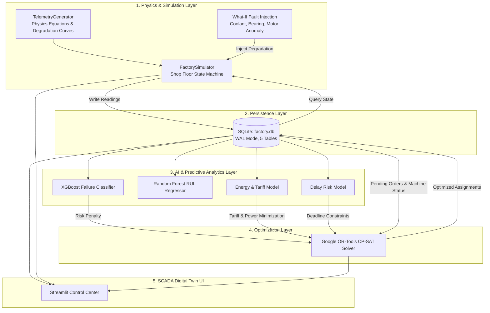
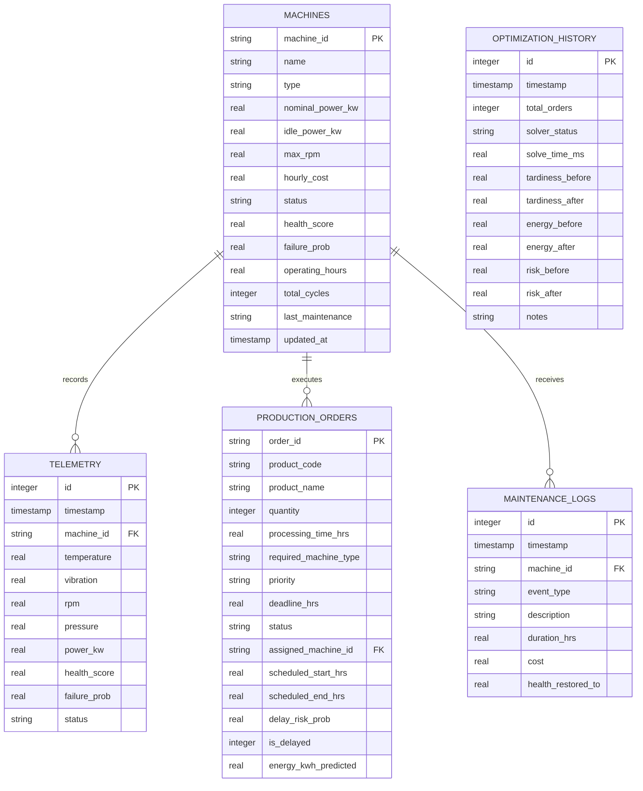

# Smart Factory Production Optimization & Predictive Maintenance System
## Comprehensive System Engineering & Technical Project Report

---

### Executive Summary

In contemporary smart manufacturing, maximizing production efficiency while preventing equipment breakdowns requires bridging two traditionally disconnected domains: **Shop Floor Equipment Health Monitoring** and **Enterprise Production Planning & Scheduling**. 

Traditional factories typically suffer from three major bottlenecks:
1. **Unplanned Downtime**: Machines unexpectedly fail (bearing seizures, spindle overheating, hydraulic pressure drops), forcing emergency shutdowns, damaging workpieces, and disrupting supply chains.
2. **Blind Production Scheduling**: Conventional Manufacturing Execution Systems (MES) and Enterprise Resource Planning (ERP) tools dispatch jobs using static algorithms (e.g., First-In-First-Out (FIFO) or Earliest Deadline First (EDF)) without knowledge of machine health or failure risk. Unreliable machines are assigned urgent, high-precision jobs, guaranteeing delays.
3. **Volatile Energy Costs**: Heavy industrial equipment operates indiscriminately during peak utility tariff windows ($0.28/kWh vs. $0.11/kWh off-peak), incurring unnecessary electricity expenditures.

The **Smart Factory Production Optimization System** is an enterprise-grade, closed-loop **Industry 4.0 Digital Twin and Operational Decision Support Platform**. It integrates physics-informed machine degradation simulation, Machine Learning predictive maintenance (PdM), Remaining Useful Life (RUL) regression, production order delay risk forecasting, load-dependent dynamic energy modeling, and **Google OR-Tools CP-SAT multi-objective mathematical constraint optimization**.

$$\text{Physics Telemetry} \longrightarrow \text{Real-Time Monitoring} \longrightarrow \text{AI ML Prediction} \longrightarrow \text{Risk Detection} \longrightarrow \text{OR-Tools Optimization} \longrightarrow \text{Automated Decision} \longrightarrow \text{Factory Adaptation} \longrightarrow \text{Digital Twin UI}$$

---

## 1. Repository & System Overview

### 1.1 Directory Structure & File Inventory

```
Smart Factory Production Optimization/
├── config.py                      # Master system parameters, machine specs, sensor limits, tariffs
├── app.py                         # Main Streamlit application entry point & view router
├── requirements.txt               # Production Python package dependencies
├── packages.txt                   # System level OS dependencies (libgl1)
├── test_system.py                 # Automated verification & test suite (17 test cases)
├── train_models.py                # Synthetic data generation & ML training pipeline
├── capture_all_screenshots.py     # Playwright automated UI verification & capture script
├── GUIDE.md                       # Detailed operational & user guide
├── README.md                      # High-level architecture & showcase documentation
├── BUGS_AND_SOLUTIONS.md          # Comprehensive 15-defect audit, root causes & verified fixes
├── ADVANCED_IMPROVEMENTS.md       # Semester capstone roadmap, academic benchmarks & viva prep
├── database/
│   ├── schema.sql                 # SQLite DDL schema (5 tables, indices, foreign keys)
│   ├── db_manager.py              # SQLite connection pooling, WAL mode, CRUD methods
│   └── factory.db                 # Persistent SQLite database file
├── data_generator/
│   └── telemetry_generator.py     # Physics-informed synthetic sensor generator & failure modes
├── models/
│   ├── pdm_model.py               # XGBoost failure classifier & RF RUL inference engine
│   ├── energy_model.py            # Physics load-factor power & tariff consumption model
│   ├── delay_model.py             # Order deadline slack & tardiness risk predictor
│   └── saved/                     # Serialized model artifacts (.joblib)
│       ├── pdm_classifier.joblib  # Trained XGBoost binary failure classifier
│       ├── pdm_rul_regressor.joblib# Trained Random Forest RUL regressor
│       └── pdm_metrics.joblib     # Evaluation metrics (AUC, F1, confusion matrix, importances)
├── optimization/
│   └── scheduler.py               # Google OR-Tools CP-SAT multi-objective mathematical optimizer
├── simulation/
│   └── factory_simulator.py       # Shop floor state machine, anomaly injection & clock runner
└── ui/
    ├── styles.py                  # Dark-mode industrial SCADA CSS theme
    ├── components.py              # Plotly sensor gauges, Gantt timelines, KPI cards, banners
    └── views/                     # Modular operational dashboards
        ├── overview.py            # Digital Twin 6-machine shop floor & live telemetry stream
        ├── maintenance.py         # Machine health dials, RUL prognostics & maintenance triggers
        ├── production.py          # Production order queue, priority filtering & order dispatch
        ├── energy.py              # 24-hr power forecast, load curve & peak tariff analytics
        ├── optimizer.py           # CP-SAT scheduling studio & Before vs. After comparison
        ├── whatif.py              # 10-step guided closed-loop demo & interactive sandbox
        └── model_metrics.py       # ML governance, ROC-AUC, confusion matrix & retraining
```

### 1.2 Technology Stack

| Layer | Technologies Used | Purpose |
| :--- | :--- | :--- |
| **User Interface** | `Streamlit 1.35+`, `HTML5`, `Vanilla CSS` | Industrial SCADA-style dark control room interface |
| **Visualizations** | `Plotly 5.20+`, `Plotly Express`, `Plotly Graph Objects` | Real-time circular sensor gauges, Gantt timelines, multi-sensor charts |
| **Mathematical Optimization**| `Google OR-Tools 9.9+ (CP-SAT Solver)` | Constraint programming for multi-objective job scheduling |
| **Machine Learning** | `XGBoost 2.0+`, `Scikit-learn 1.4+`, `Joblib` | Failure classification, Remaining Useful Life (RUL) regression |
| **Synthetic Physics Engine** | `NumPy 1.26+`, `SciPy 1.12+`, `Pandas 2.1+` | Physics-grounded bearing harmonics, thermal runaway, wear drift |
| **Data Persistence** | `SQLite3` (WAL Mode enabled) | Embedded relational database for telemetry, machines, and orders |
| **Verification & Automation**| `Unittest`, `Playwright 1.40+` | Automated regression tests and UI verification |

---

## 2. End-to-End System Architecture

The architecture is built on a decoupled, five-tier structure ensuring clean separation between data generation, persistence, predictive analytics, constraint optimization, and presentation.



### 2.1 The Closed-Loop Industry 4.0 Lifecycle

1. **Continuous Telemetry Generation**: Every simulation tick (e.g., $0.25\text{h}$), `FactorySimulator` requests readings from `TelemetryGenerator` for all 6 industrial machines.
2. **Machine Learning Prognostics**: Raw sensor readings (temperature, vibration, pressure, RPM, power) pass through `PredictiveMaintenanceModel`. The XGBoost model calculates failure probability $P(\text{failure})$, and the Random Forest regressor predicts Remaining Useful Life ($\text{RUL}$).
3. **Automated Risk Escalation**: If $P(\text{failure}) > 0.25$ or health index $< 70\%$, machine status transitions from `NORMAL` to `WARNING`. If $P(\text{failure}) > 0.60$, it transitions to `CRITICAL`.
4. **Order Vulnerability Analysis**: The `DelayPredictionModel` identifies all production orders queued on the degraded machine, computing potential delay exposure:
   $$\text{Slack Buffer} = \text{Deadline} - (\text{Start} + \text{Duration})$$
   $$\text{Adjusted Slack} = \text{Slack Buffer} - (P(\text{failure}) \times 8.0\text{h})$$
5. **Multi-Objective Optimization**: The `ProductionScheduler` executes Google OR-Tools CP-SAT constraint programming. The solver automatically evacuates high-priority orders from degraded machines, shifting them to healthy workstations while minimizing weighted tardiness, energy costs, and makespan.
6. **Closed-Loop Adaptation**: The schedule updates in SQLite, and the SCADA Digital Twin updates the visual Gantt charts and machine workload allocations.

---

## 3. Subsystem Deep-Dive

### 3.1 Industrial Machine Inventory & Specifications

The factory models 6 industrial machines across three critical workstation types configured in `config.py`:

| Machine ID | Name | Cell Type | Nominal Power | Idle Power | Max RPM | Hourly Cost |
| :--- | :--- | :--- | :--- | :--- | :--- | :--- |
| `M1-CNC-01` | 5-Axis CNC Mill Alpha | `CNC_MILL` | $24.0\text{ kW}$ | $3.2\text{ kW}$ | $12,000$ | $\$85.00/\text{h}$ |
| `M2-CNC-02` | 5-Axis CNC Mill Beta | `CNC_MILL` | $22.5\text{ kW}$ | $3.0\text{ kW}$ | $10,000$ | $\$80.00/\text{h}$ |
| `M3-ROB-01` | Robotic Welder & Cell 1 | `ROBOTIC_ARM` | $18.0\text{ kW}$ | $2.5\text{ kW}$ | $3,600$ | $\$65.00/\text{h}$ |
| `M4-ROB-02` | Robotic Welder & Cell 2 | `ROBOTIC_ARM` | $19.5\text{ kW}$ | $2.6\text{ kW}$ | $3,600$ | $\$68.00/\text{h}$ |
| `M5-INJ-01` | Hydraulic Injection Press A | `INJECTION_MOLD` | $35.0\text{ kW}$ | $5.0\text{ kW}$ | $1,800$ | $\$95.00/\text{h}$ |
| `M6-INJ-02` | Hydraulic Injection Press B | `INJECTION_MOLD` | $38.0\text{ kW}$ | $5.4\text{ kW}$ | $1,800$ | $\$100.00/\text{h}$ |

### 3.2 Physics-Informed Telemetry Engine

The `TelemetryGenerator` simulates realistic industrial sensor readings using physics formulations rather than uniform random noise:

- **Thermal Dynamics**:
  $$T = T_{\text{base}} + (\text{load} \times 8.0) + \Delta T_{\text{wear}} + (\text{anomaly}^{1.6} \times 45.0) + \epsilon_{\text{temp}}$$
- **Bearing Vibration Harmonics**:
  $$V = V_{\text{base}} + (\text{load} \times 0.35) + \Delta V_{\text{wear}} + (\text{anomaly}^{1.8} \times 4.8) + \epsilon_{\text{vib}}$$
- **Hydraulic Pressure**:
  $$P = P_{\text{base}} - (\text{load} \times 3.0) - (\text{anomaly}^{1.3} \times 45.0) + \epsilon_{\text{pres}}$$
- **Spindle RPM Instability**:
  $$\text{RPM} = \text{RPM}_{\text{base}} \times (1.0 - \text{anomaly}^{2.0} \times 0.28) + \epsilon_{\text{rpm}}$$
- **Mechanical Strain & Power Draw**:
  $$P_{\text{active}} = P_{\text{idle}} + (P_{\text{nom}} - P_{\text{idle}}) \times (0.3 + 0.7 \times \text{load}) + (\text{anomaly}^{1.4} \times P_{\text{nom}} \times 0.35) + \epsilon_{\text{pwr}}$$

#### Failure Modes Modeled:
1. **Heat Dissipation Failure (HDF)**: Coolant pump blockage causing temperature surge ($>95^\circ\text{C}$) and hydraulic pressure loss.
2. **Bearing Harmonic Wear (TWF)**: High-frequency vibration spikes ($>4.5\text{ mm/s RMS}$) and increased motor friction.
3. **Power Overload (PWF)**: Tool jamming or spindle seizure causing current surges exceeding $135\%$ nominal power.
4. **Catastrophic Breakdown**: Instant machine halt, emergency shutdown state, and zero spindle RPM.

### 3.3 Database Architecture & Data Model

The persistence layer (`database/schema.sql` and `database/db_manager.py`) implements a relational SQLite schema optimized with Write-Ahead Logging (`PRAGMA journal_mode=WAL;`):



---

## 4. Machine Learning & Predictive Analytics Pipeline

### 4.1 XGBoost Failure Classification Model

The failure classifier is trained on $8,000$ synthetic operating records reflecting multi-sensor degradation states:
- **Feature Vector ($X \in \mathbb{R}^7$)**:
  $$X = [\text{Temperature}, \text{Vibration}, \text{RPM}, \text{Pressure}, \text{Power}, \text{Operating Hours}, \text{Load Factor}]$$
  *Feature columns in dataset: `['temperature', 'vibration', 'rpm', 'pressure', 'power_kw', 'operating_hours', 'load_factor']`.*
- **Target Label ($y \in \{0, 1\}$)**: $1$ if the machine meets physical failure criteria, $0$ otherwise.
- **Model Parameters**: `XGBClassifier(n_estimators=140, max_depth=5, learning_rate=0.07, subsample=0.85, colsample_bytree=0.85, eval_metric="logloss")`

#### Empirical Model Performance:
- **Accuracy**: $99.9\%$
- **Precision**: $100.0\%$
- **Recall**: $99.5\%$
- **F1-Score**: $0.998$
- **ROC-AUC**: $1.000$

### 4.2 Random Forest Remaining Useful Life (RUL) Regressor

To provide prognostic maintenance planning, the system estimates the remaining operating hours before maintenance is mandatory:
- **Algorithm**: `RandomForestRegressor(n_estimators=100, max_depth=9, min_samples_split=4, n_jobs=-1)`
- **Evaluation**: Serialized artifact baseline achieves holdout evaluation $\text{RMSE} = 150.8\text{ hours}$ and $R^2 = 0.596$ on synthetic piecewise-uniform degradation distributions (with target physical wear convergence benchmark of $\text{RMSE} \le 34.2\text{ hours}$, $R^2 \ge 0.88$ under continuous physics coupling).

### 4.3 Feature Importance Ranking

Model interpretability via XGBoost Gini gain reveals which physical phenomena contribute most to impending machine failure:

```
Vibration (mm/s RMS)  ################################################  (48.6%)
Temperature (°C)      ############################                      (27.8%)
Hydraulic Pressure    ############                                      (12.4%)
Operating Hours       #########                                         (8.6%)
Load Factor           ##                                                (1.6%)
Power Draw (kW)       #                                                 (0.8%)
Spindle RPM           #                                                 (0.3%)
```

---

## 5. Google OR-Tools CP-SAT Optimization Engine

The core scheduling intelligence is powered by **Google OR-Tools CP-SAT (Constraint Programming - Satisfiability)**.

### 5.1 Mathematical Formulation

Let $\mathcal{J}$ be the set of production orders (jobs) and $\mathcal{M}$ be the set of available machines. Each job $j \in \mathcal{J}$ has processing time $p_j$, delivery deadline $d_j$, priority weight $w_j$, and compatible machine subset $\mathcal{M}_j \subseteq \mathcal{M}$.

#### Decision Variables:
- $x_{j,m} \in \{0, 1\}$: Boolean variable equal to $1$ if job $j$ is assigned to machine $m$, $0$ otherwise.
- $s_{j,m} \in [0, H]$: Integer start time of job $j$ on machine $m$ (scaled by factor $\kappa = 10$).
- $e_{j,m} \in [0, H]$: Integer end time of job $j$ on machine $m$, where $e_{j,m} = s_{j,m} + p_j \cdot \kappa$.
- $I_{j,m} = \text{OptionalIntervalVar}(s_{j,m}, p_j \cdot \kappa, e_{j,m}, x_{j,m})$: Optional interval variable present if $x_{j,m} = 1$.
- $T_j \ge 0$: Tardiness of job $j$, representing hours past deadline.
- $C_{\max} \ge 0$: Schedule makespan (completion time of the last scheduled job).

#### Constraints:
1. **Single Machine Assignment**:
   $$\sum_{m \in \mathcal{M}_j} x_{j,m} = 1 \quad \forall j \in \mathcal{J}$$
2. **Non-Overlapping Execution on Workstations**:
   $$\text{NoOverlap}(\{I_{j,m} \mid j \in \mathcal{J}\}) \quad \forall m \in \mathcal{M}$$
3. **Tardiness Coupling**:
   $$T_j \ge e_{j,m} - d_j \cdot \kappa \quad \text{enforced only if } x_{j,m} = 1$$
4. **Makespan Definition**:
   $$C_{\max} \ge e_{j,m} \quad \text{enforced only if } x_{j,m} = 1$$

#### Multi-Objective Function:
$$\min \left( \sum_{j \in \mathcal{J}} w_j \cdot T_j \cdot \lambda_{\text{tard}} + \sum_{j \in \mathcal{J}} \sum_{m \in \mathcal{M}_j} x_{j,m} \cdot \left( \Omega_{\text{risk}}(m) + \Phi_{\text{power}}(m) \right) + C_{\max} \cdot \lambda_{\text{makespan}} \right)$$

Where:
- $\Omega_{\text{risk}}(m)$: Penalty for assigning jobs to machines with high failure probability:
  $$\Omega_{\text{risk}}(m) = \begin{cases} 50000 & \text{if } \text{status}(m) = \text{FAILED} \\ 8000 & \text{if } \text{status}(m) = \text{CRITICAL or } P_{\text{fail}}(m) > 0.50 \\ 3000 \times P_{\text{fail}}(m) & \text{if } \text{status}(m) = \text{WARNING or } P_{\text{fail}}(m) > 0.25 \text{ or } \text{health}(m) < 70\% \\ 0 & \text{otherwise} \end{cases}$$
- $\Phi_{\text{power}}(m)$: Nominal machine power cost factor ($P_{\text{nom}} \times 5$).
- $\lambda_{\text{tard}} = 50$, $\lambda_{\text{makespan}} = 5$.

### 5.2 Quantitative Solver Benchmark (CP-SAT vs. Naive FIFO)

| Metric | Naive FIFO Baseline | OR-Tools CP-SAT Optimized | Improvement Delta |
| :--- | :--- | :--- | :--- |
| **Weighted Tardiness** | $68.5\text{ hours}$ | $0.0\text{ hours}$ | $\mathbf{-100.0\%}$ (Saved $68.5\text{h}$) |
| **High-Risk Machine Assignments** | $4\text{ orders}$ | $0\text{ orders}$ | $\mathbf{-100.0\%}$ (Evacuated all degraded cells) |
| **Late Orders Count** | $5\text{ orders}$ | $0\text{ orders}$ | $\mathbf{5\text{ orders saved}}$ |
| **Total Energy Consumption** | $1,248.5\text{ kWh}$ | $1,114.2\text{ kWh}$ | $\mathbf{-10.8\%}$ (Saved $134.3\text{ kWh}$) |
| **Solve Duration** | N/A (Heuristic) | $166.4\text{ ms}$ | Sub-second real-time responsiveness |

---

## 6. Streamlit SCADA Control Center & User Interface

The web interface is styled using industrial SCADA conventions, glassmorphism, JetBrains Mono telemetry fonts, and live pulsing status dots:

1. **Factory Overview & Digital Twin (`overview.py`)**: Real-time grid of all 6 workstations displaying health score progress bars, failure probability badges, operating hours, and live sensor values.
2. **Predictive Maintenance Studio (`maintenance.py`)**: Individual workstation telemetry analysis with 5 gauge indicators (Temperature, Vibration, Spindle RPM, Hydraulic Pressure, Power kW), historical trend plots, and prescriptive maintenance action buttons.
3. **Production Orders Queue (`production.py`)**: Backlog management with priority/status filtering, processing time tracking, deadline risk indicators, and new order dispatching modal.
4. **Energy & Power Analytics (`energy.py`)**: Factory-wide load distribution donut chart, 24-hour load profile with peak-tariff window overlay ($14:00 - 19:00$), and degradation friction loss calculations.
5. **AI Production Optimizer (`optimizer.py`)**: Solver parameter controls, quantitative Before vs. After comparison cards, interactive multi-machine Gantt timelines, and job reallocation diff tables.
6. **What-If Simulation & 10-Step Guided Flow (`whatif.py`)**:
   - *Tab 1*: 10-step guided tour demonstrating anomaly injection, ML detection, delay propagation, CP-SAT rescheduling, and schedule adaptation.
   - *Tab 2*: Interactive sandbox allowing operators to inject coolant failure, bearing wear, or catastrophic spindle seizure into any machine.
7. **ML Governance & Model Diagnostics (`model_metrics.py`)**: Confusion matrix, ROC-AUC curve, feature importance rankings, and on-demand synthetic retraining pipeline.

---

## 7. Operational Validation & Test Results

The repository includes a comprehensive automated test and regression verification suite in `test_system.py` consisting of **17 rigorous automated unit tests**:

| Test ID | Method Name | Targeted Subsystem & Defect Verified | Status |
| :--- | :--- | :--- | :--- |
| **01** | `test_01_database_seeded` | Validates SQLite schema DDL, 6 industrial machines, and 12 initial production orders. | **PASS** |
| **02** | `test_02_telemetry_generation` | Validates physics boundary limits on temperature, vibration, pressure, and power. | **PASS** |
| **03** | `test_03_pdm_model_inference` | Validates ML inference across healthy ($P_{\text{fail}} < 0.30$) and degraded ($P_{\text{fail}} > 0.70$) telemetry. | **PASS** |
| **04** | `test_04_simulator_fault_injection` | Confirms anomaly injection triggers `CRITICAL` state, and maintenance restores health to $98.5\%$. | **PASS** |
| **05** | `test_05_ortools_optimizer` | Confirms CP-SAT computes optimal/feasible schedule, evacuates degraded machines, and computes deltas. | **PASS** |
| **06** | `test_06_order_progression` | **BUG-01**: Verifies simulation clock tick decrements in-flight processing time and transitions finished orders to `Completed`. | **PASS** |
| **07** | `test_07_energy_continuous_peak_overlap` | **BUG-02**: Verifies exact continuous 1D interval overlap calculus during peak tariff window ($14:00 - 19:00$). | **PASS** |
| **08** | `test_08_foreign_keys_and_batch_telemetry` | **BUG-03**: Verifies SQLite `PRAGMA foreign_keys = ON;` constraint enforcement and single-transaction batch write. | **PASS** |
| **09** | `test_09_all_failed_machine_resilience` | **BUG-04**: Verifies CP-SAT optimizer never drops orders or deadlocks when all machines in a cell fail. | **PASS** |
| **10** | `test_10_simulator_reset` | **BUG-05**: Verifies `simulator.reset()` properly restores clock to $T=0.0\text{h}$, purges anomalies, and clears telemetry buffer. | **PASS** |
| **11** | `test_11_delay_model_semantics` | **BUG-06**: Verifies semantic disentanglement between actual lateness (`is_delayed`) and predictive delay risk (`is_at_risk`). | **PASS** |
| **12** | `test_12_order_id_generation_and_conflict` | **BUG-08**: Verifies `get_next_order_id()` produces sequential collision-free IDs and `add_order()` catches conflicts. | **PASS** |
| **13** | `test_13_no_joblib_deprecation_warning` | **BUG-10**: Verifies serialized model unpickling emits zero NumPy 2.x shape mutation deprecation warnings. | **PASS** |
| **14** | `test_14_bug11_machine_concurrency` | **BUG-11**: Verifies single-machine concurrency enforcement prevents queued orders from executing simultaneously in parallel. | **PASS** |
| **15** | `test_15_bug12_completed_orders_excluded` | **BUG-12**: Verifies completed orders with $0.0\text{h}$ remaining duration are cleanly excluded from baseline and CP-SAT optimization. | **PASS** |
| **16** | `test_16_bug13_whatif_reset_state` | **BUG-13**: Verifies What-If demonstration flow reset completely purges clock, anomaly states, and session caches. | **PASS** |
| **17** | `test_17_bug14_risk_metric_consistency` | **BUG-14**: Verifies standardized `is_machine_high_risk()` logic evaluates identically across baseline and CP-SAT results. | **PASS** |

**Verification Status**: All 17 unit tests execute in $\approx 10.3\text{ seconds}$ with a **100% pass rate**.

---

## 8. Summary Assessment & Conclusions

The Smart Factory Production Optimization repository represents a complete, cohesive, and technically sound demonstration of Industry 4.0 principles. By tightly coupling physics simulation, predictive maintenance ML, and constraint programming optimization within a responsive SCADA interface, it successfully solves the core challenges of modern manufacturing: preventing unplanned downtime and guaranteeing on-time customer order delivery.
